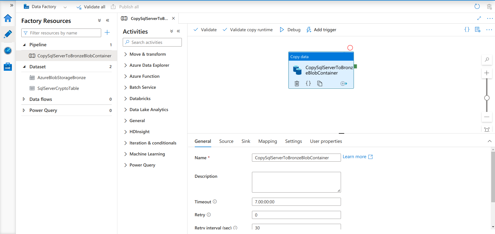

# ETL on Azure

This pipeline is an ETL application, which aims to collect data for a few minutes from Binance's open API for cryptocurrencies:

  - BTCUSDT
  - ADAUSDT 
  - ETHUSDT
  - BNBUSDT
  - LTCUSDT

List of tools we will be using:

## Azure Tools
- AKS
- SQL Server
- SQL Server Database
- Data Factory
- Databricks
- Synapse
- Cosmosdb
- Datalake Gen1 / Gen2
- Azure Active Directory (Apps)
- Blob Storage

## GitOps
- ArgoCD

## Resource Construction
- Terraform

## Pipeline Orchestration
- Airflow (_Helm Chart used:_ https://artifacthub.io/packages/helm/airflow-helm/airflow)

## CI/CD (Github Workflow)
- `AKS.yml` kubernetes cluster creation
- `resources1.yml` for building resources_1
- `resources2.yml` for building resources_2
- `destroy.yml` for resource destruction

First of all, we need to create a blob container in our storage account that will hold the state of our infrastructure.

## Terraform Scripts

Now let's talk about the codes for building our resources with Terraform.

#### [backend_aks](k8s/resources/AKS/backend.tf)
#### [backend_resources_1](k8s/resources/resources_1/backend.tf)
#### [backend_resources_2](k8s/resources/resources_2/backend.tf)

As mentioned earlier, it is being created to store the state of our infrastructure in our blob container.

```terraform
terraform {
  backend "azurerm" {
    resource_group_name  = "vinietlazure"
    storage_account_name = "vinietlazure"
    container_name       = "tfstateaks"
    key                  = "terraform/tfstate"
  }
}

terraform {
  backend "azurerm" {
    resource_group_name  = "vinietlazure"
    storage_account_name = "vinietlazure"
    container_name       = "tfstateresources1"
    key                  = "terraform/tfstate"
  }

terraform {
  backend "azurerm" {
    resource_group_name  = "vinietlazure"
    storage_account_name = "vinietlazure"
    container_name       = "tfstateresources2"
    key                  = "terraform/tfstate"
  }
}
```


### [TERRAFORM AKS](k8s/resources/AKS)

#### [versions.tf](k8s/resources/AKS/versions.tf)

Here basically are the required versions of providers.

```terraform
terraform {
  required_providers {

    azurerm = {
      source  = "hashicorp/azurerm"
      version = ">= 2.95.0"
    }

    kubectl = {
      source  = "gavinbunney/kubectl"
      version = ">= 1.13.0"
    }
  }

  required_version = ">= 0.14"
}

```

#### [variables.tf](k8s/resources/AKS/variables.tf)

Here are basically the variables that we will use in other scripts.

```terraform
variable "resource_group_name" {
  default = "vinietlazure"
}

variable "location" {
  default = "East US"
}

```

#### [provider.tf](k8s/resources/AKS/provider.tf)

Here are the necessary providers and access permissions to use commands in terraform codes.

```terraform
data "azurerm_kubernetes_cluster" "aks_cluster" {
  name                = azurerm_kubernetes_cluster.aks_cluster.name
  resource_group_name = var.resource_group_name

  depends_on = [
    azurerm_kubernetes_cluster.aks_cluster
  ]
}

provider "azurerm" {
  features {}
}

provider "kubernetes" {
  apply_retry_count      = 5
  host                   = data.azurerm_kubernetes_cluster.aks_cluster.kube_config.0.host
  client_certificate     = base64decode(data.azurerm_kubernetes_cluster.aks_cluster.kube_config.0.client_certificate)
  client_key             = base64decode(data.azurerm_kubernetes_cluster.aks_cluster.kube_config.0.client_key)
  cluster_ca_certificate = base64decode(data.azurerm_kubernetes_cluster.aks_cluster.kube_config.0.cluster_ca_certificate)
  load_config_file       = false
}

provider "kubectl" {
  apply_retry_count      = 5
  host                   = data.azurerm_kubernetes_cluster.aks_cluster.kube_config.0.host
  client_certificate     = base64decode(data.azurerm_kubernetes_cluster.aks_cluster.kube_config.0.client_certificate)
  client_key             = base64decode(data.azurerm_kubernetes_cluster.aks_cluster.kube_config.0.client_key)
  cluster_ca_certificate = base64decode(data.azurerm_kubernetes_cluster.aks_cluster.kube_config.0.cluster_ca_certificate)
  load_config_file       = false
}

```

#### [apps.tf](k8s/resources/AKS/apps.tf)

At this stage of the process, everything happens in parts. First the `argocd` and `airflow` namespaces are created.

Afterwards, the [installation](k8s/resources/charts/argocd/install.yaml) file is applied to the argocd namespace.

- After argocd is deployed, it will authenticate to the private repository, which I will explain how you will make it work.

- Afterwards, a secret will be created in the `airflow` namespace that will give access to the private repository, which I will also explain how you will make it work.

- Afterwards, the airflow will be deployed in the `airflow` namespace, automatically.

- And finally, you will pass your credentials that you will use in the values.yaml of your chart, which I will also show.

```terraform
data "kubectl_file_documents" "namespace" {
  content = file("../charts/argocd/namespace.yaml")
}
resource "kubectl_manifest" "namespace" {
  count              = length(data.kubectl_file_documents.namespace.documents)
  yaml_body          = element(data.kubectl_file_documents.namespace.documents, count.index)
  override_namespace = "argocd"
  depends_on = [
    data.kubectl_file_documents.namespace,
    azurerm_kubernetes_cluster.aks_cluster
  ]
}

data "kubectl_file_documents" "argocd" {
  content = file("../charts/argocd/install.yaml")
}

resource "kubectl_manifest" "argocd" {
  count              = length(data.kubectl_file_documents.argocd.documents)
  yaml_body          = element(data.kubectl_file_documents.argocd.documents, count.index)
  override_namespace = "argocd"
  depends_on = [
    kubectl_manifest.namespace,
    data.kubectl_file_documents.argocd,
    azurerm_kubernetes_cluster.aks_cluster
  ]
}

data "kubectl_file_documents" "git" {
  content = file("../charts/argocd/auth.yaml")
}

resource "kubectl_manifest" "git" {
  count              = length(data.kubectl_file_documents.git.documents)
  yaml_body          = element(data.kubectl_file_documents.git.documents, count.index)
  override_namespace = "argocd"
  depends_on = [
    kubectl_manifest.argocd,
    data.kubectl_file_documents.git
  ]
}

data "kubectl_file_documents" "airflow_key" {
  content = file("../charts/airflow/airflow_access_git_repo/ssh.yaml")
}

resource "kubectl_manifest" "airflow_manifest" {
  count              = length(data.kubectl_file_documents.airflow_key.documents)
  yaml_body          = element(data.kubectl_file_documents.airflow_key.documents, count.index)
  override_namespace = "airflow"
  depends_on = [
    kubectl_manifest.argocd,
    data.kubectl_file_documents.airflow_key
  ]
}

data "kubectl_file_documents" "airflow" {
  content = file("../apps/airflow-app.yaml")
}

resource "kubectl_manifest" "airflow" {
  count              = length(data.kubectl_file_documents.airflow.documents)
  yaml_body          = element(data.kubectl_file_documents.airflow.documents, count.index)
  override_namespace = "argocd"
  depends_on = [
    kubectl_manifest.argocd,
    data.kubectl_file_documents.airflow,
    azurerm_kubernetes_cluster.aks_cluster
  ]
}

data "kubectl_file_documents" "keys" {
  content = file("../keys_base64/keys.yml")
}

resource "kubectl_manifest" "keys" {
  count              = length(data.kubectl_file_documents.keys.documents)
  yaml_body          = element(data.kubectl_file_documents.keys.documents, count.index)
  override_namespace = "airflow"
  depends_on = [
    data.kubectl_file_documents.keys,
    data.kubectl_file_documents.airflow,
    kubectl_manifest.argocd,
    kubectl_manifest.airflow
  ]
}

```

#### [aks.tf](k8s/resources/AKS/aks.tf)

Here is our main script which is creating a kubernetes cluster with simple settings.

```terraform
resource "azurerm_kubernetes_cluster" "aks_cluster" {
  name                = "cluster-aks-${var.resource_group_name}"
  location            = var.location
  resource_group_name = var.resource_group_name
  dns_prefix          = "k8s-${var.resource_group_name}"

  default_node_pool {
    name                = "default"
    vm_size             = "Standard_D4_v2"
    enable_auto_scaling = true
    max_count           = 2
    min_count           = 1
    node_count          = 1
  }

  public_network_access_enabled   = true
  api_server_authorized_ip_ranges = ["0.0.0.0/0"]

  identity {
    type = "SystemAssigned"
  }

  role_based_access_control {
    enabled = true
  }

  tags = {
    Vini = "ETL-AZURE-AKS"
  }

}

```

#### [output.tf](k8s/resources/AKS/output.tf)

Here it is basically just for us to see the cluster name after it is created in the terraform log output.

```terraform
output "kubernetes_cluster_name" {
  value = azurerm_kubernetes_cluster.aks_cluster.name
}

```


### [TERRAFORM RESOURCES_1](k8s/resources/resources_1)

#### [versions.tf](k8s/resources/resources_1/versions.tf)

Here basically are the required versions of providers.

```terraform
terraform {
  required_providers {

    azurerm = {
      source  = "hashicorp/azurerm"
      version = ">= 2.95.0"
    }
  }

  required_version = ">= 0.14"
}

```

#### [variables.tf](k8s/resources/resources_1/variables.tf)

Here are basically the variables that we will use in other scripts. 
```diff 
- Remembering that it is not a good practice to leave passwords exposed like this in the codes, as this is just a study, there are no problems.
```


```terraform
variable "storage_account_name" {
  default = "vinietlazure"
}

variable "resource_group_name" {
  default = "vinietlazure"
}

variable "location" {
  default = "East US"
}

variable "sqlserver_user" {
  default = "vinietlazure"
}

variable "sqlserver_pass" {
  default = "A1b2C3d4"
}

variable "containers_names" {
  type = list(string)
  default = [
    "bronze",
    "silver",
    "gold"
  ]
}

```

#### [storage_containers.tf](k8s/resources/resources_1/storage_containers.tf)

Here we are basically iterating through our variables with a list of strings to create the container blobs that will be used in the ETL.

```terraform
resource "azurerm_storage_container" "containers" {
  for_each              = toset(var.containers_names)
  name                  = each.key
  storage_account_name  = var.storage_account_name
  container_access_type = "container"
}

```

#### [server.tf](k8s/resources/resources_1/server.tf)

Here we are creating our server to use our SQL SERVER database.

```terraform
resource "azurerm_mssql_server" "sql_server" {
  name                          = "sqlserver-vinietlazure"
  resource_group_name           = var.resource_group_name
  location                      = var.location
  version                       = "12.0"
  administrator_login           = var.sqlserver_user
  administrator_login_password  = var.sqlserver_pass
  minimum_tls_version           = "1.2"
  public_network_access_enabled = true

  tags = {
    Vini = "ETL-AZURE"
  }
}

```

#### [provider.tf](k8s/resources/resources_1/provider.tf)

Here is basically the only provider we need to interact with Azure.

```terraform
provider "azurerm" {
  features {}
}

```

#### [firewall_database.tf](k8s/resources/resources_1/firewall_database.tf)

Here is the creation of the database firewall, ie the access permission level, we are releasing all access from any azure tool on it.

```terraform
resource "azurerm_mssql_firewall_rule" "firewall_database" {
  name             = "FirewallSqlServer"
  server_id        = azurerm_mssql_server.sql_server.id
  start_ip_address = "0.0.0.0"
  end_ip_address   = "0.0.0.0"

  depends_on = [
    azurerm_mssql_database.vinidatabaseazure
  ]
}

```

#### [database.tf](k8s/resources/resources_1/database.tf)

And finally, the main, our SQL SERVER database with a size of 1gb, simple.

```terraform
resource "azurerm_mssql_database" "vinidatabaseazure" {
  name                 = "database-sqlserver-vinietlazure"
  server_id            = azurerm_mssql_server.sql_server.id
  collation            = "SQL_Latin1_General_CP1_CI_AS"
  license_type         = "LicenseIncluded"
  max_size_gb          = 1
  storage_account_type = "LRS"

  tags = {
    Vini = "ETL-AZURE"
  }

  depends_on = [
    azurerm_mssql_server.sql_server
  ]

}

```


### [TERRAFORM RESOURCES_2](k8s/resources/resources_2)

#### [versions.tf](k8s/resources/resources_2/versions.tf)

Here basically are the required versions of providers.

```terraform
terraform {
  required_providers {

    azurerm = {
      source  = "hashicorp/azurerm"
      version = ">= 2.95.0"
    }

    azuread = {
      source  = "hashicorp/azuread"
      version = ">= 2.17.0"
    }

    databricks = {
      source  = "databrickslabs/databricks"
      version = ">= 0.4.8"
    }

    null = {
      version = ">= 3.1.0"
      source  = "hashicorp/null"
    }
  }

  required_version = ">= 0.14"
}

```

#### [variables.tf](k8s/resources/resources_2/variables.tf)

Here are basically the variables that we will use in other scripts. 
```diff 
- Remembering that it is not a good practice to leave passwords exposed like this in the codes, as this is just a study, there are no problems.
```

```terraform
variable "storage_account_name" {
  default = "vinietlazure"
}

variable "resource_group_name" {
  default = "vinietlazure"
}

variable "location" {
  default = "East US"
}

variable "synapse_user" {
  default = "vinietlazure"
}

variable "synapse_pass" {
  default = "A1b2C3d4"
}

```

#### [linked_services.tf](k8s/resources/resources_2/linked_services.tf)

Here we are creating the linked services to interact with our database and blob containers in the specified storage account.

```terraform
resource "azurerm_data_factory_linked_service_sql_server" "SqlServerToBronzeBlobContainer" {
  name                = "SqlServerToBronzeBlobContainer"
  resource_group_name = var.resource_group_name
  data_factory_id     = azurerm_data_factory.vinidatafactoryazure.id
  connection_string   = "integrated security=False;data source=sqlserver-vinietlazure.database.windows.net;initial catalog=database-sqlserver-vinietlazure;user id=vinietlazure; pwd=A1b2C3d4"

}

resource "azurerm_data_factory_linked_service_azure_blob_storage" "AzureBlobStorageBronze" {
  name                = "AzureBlobStorageBronze"
  resource_group_name = var.resource_group_name
  data_factory_id     = azurerm_data_factory.vinidatafactoryazure.id
  connection_string   = "DefaultEndpointsProtocol=https;AccountName=vinietlazure;AccountKey=your-account-key;EndpointSuffix=core.windows.net"

}

```

#### [datasets.tf](k8s/resources/resources_2/datasets.tf)

Here is the creation of the datasets that we will need to create our pipeline in the datafactory. Basically, the first dataset points to the table in SQL SERVER to copy to a blob container, while the second one, transforms the data thrown to the blob container into parquet.

```terraform
resource "azurerm_data_factory_dataset_sql_server_table" "SqlServerCryptoTable" {
  name                = "SqlServerCryptoTable"
  table_name          = "crypto"
  resource_group_name = var.resource_group_name
  data_factory_id     = azurerm_data_factory.vinidatafactoryazure.id
  linked_service_name = azurerm_data_factory_linked_service_sql_server.SqlServerToBronzeBlobContainer.name
}

resource "azurerm_data_factory_dataset_parquet" "AzureBlobStorageBronze" {
  name                = "AzureBlobStorageBronze"
  resource_group_name = var.resource_group_name
  data_factory_id     = azurerm_data_factory.vinidatafactoryazure.id
  linked_service_name = azurerm_data_factory_linked_service_azure_blob_storage.AzureBlobStorageBronze.name
  compression_codec   = "snappy"

  azure_blob_storage_location {
    container = "bronze"
    path      = "data"
    filename  = "crypto.parquet"
  }
}
```

#### [datafactory.tf](k8s/resources/resources_2/datafactory.tf) 

Here is basically the creation of a datafactory workspace and a pipeline of type COPY, using our datasets.

```terraform
resource "azurerm_data_factory" "vinidatafactoryazure" {
  name                   = "vinidatafactoryazure"
  location               = var.location
  resource_group_name    = var.resource_group_name
  public_network_enabled = true

  tags = {
    Vini = "ETL-AZURE"
  }

}

resource "azurerm_data_factory_pipeline" "CopySqlServerToBronzeBlobContainer" {
  name                = "CopySqlServerToBronzeBlobContainer"
  resource_group_name = var.resource_group_name
  data_factory_id     = azurerm_data_factory.vinidatafactoryazure.id

  activities_json = <<JSON
[
  {
    "name": "CopySqlServerToBronzeBlobContainer",
    "type": "Copy",
    "policy": {
        "timeout": "7.00:00:00",
        "retry": 0,
        "retryIntervalInSeconds": 30,
        "secureOutput": false,
        "secureInput": false
    },
    "typeProperties": {
        "source": {
            "type": "SqlServerSource",
            "queryTimeout": "02:00:00",
            "partitionOption": "None"
        },
        "sink": {
            "type": "ParquetSink",
            "storeSettings": {
                "type": "AzureBlobStorageWriteSettings"
            },
            "formatSettings": {
                "type": "ParquetWriteSettings"
            }
        },
        "enableStaging": false
    },
    "inputs": [
        {
            "referenceName": "SqlServerCryptoTable",
            "type": "DatasetReference"
        }
    ],
    "outputs": [
        {
            "referenceName": "AzureBlobStorageBronze",
            "type": "DatasetReference"
        }
    ]
  }
]
  JSON

  depends_on = [
    azurerm_data_factory.vinidatafactoryazure,
    azurerm_data_factory_linked_service_sql_server.SqlServerToBronzeBlobContainer,
    azurerm_data_factory_linked_service_azure_blob_storage.AzureBlobStorageBronze
  ]

}

```




#### [azure_application.tf](k8s/resources/resources_2/azure_application.tf)

Here we are creating an application in Azure Active Directory to be able to trigger our data factory pipeline, but also that will have permission level on other resources.

```terraform
data "azuread_client_config" "current" {}

resource "azuread_application" "azure_application" {
  display_name = "RunADFPipelineApplication"
  owners       = [data.azuread_client_config.current.object_id]

  depends_on = [
    azurerm_data_factory.vinidatafactoryazure
  ]
}

resource "azuread_application_password" "azure_application_password" {
  display_name          = "DataFactoryPassword"
  application_object_id = azuread_application.azure_application.object_id

  depends_on = [
    azurerm_data_factory.vinidatafactoryazure
  ]
}

resource "azuread_service_principal" "service_principal" {
  application_id               = azuread_application.azure_application.application_id
  app_role_assignment_required = false
  owners                       = [data.azuread_client_config.current.object_id]
}

```

#### [role_assignment.tf](k8s/resources/resources_2/role_assignment.tf)

Here we are basically creating and applying some specific types of roles so that our resources can interact at the Owner level.

```terraform
data "azuread_service_principals" "service_principal_databricks" {
  display_names = [
    "Databricks Resource Provider"
  ]

  depends_on = [
    azurerm_databricks_workspace.databricks_workspace
  ]
}

resource "azurerm_role_assignment" "role_assignment_1" {
  scope                = "/subscriptions/your-code-global-admin"
  role_definition_name = "Owner"
  principal_id         = azuread_service_principal.service_principal.object_id

  depends_on = [
    azuread_application.azure_application,
    azuread_application_password.azure_application_password,
    azuread_service_principal.service_principal,
    data.azuread_service_principals.service_principal_databricks
  ]
}

resource "azurerm_role_assignment" "role_assignment_2" {
  scope                = "/subscriptions/your-code-global-admin"
  role_definition_name = "Owner"
  principal_id         = data.azuread_service_principals.service_principal_databricks.object_ids[0]

  depends_on = [
    azuread_application.azure_application,
    azuread_application_password.azure_application_password,
    azuread_service_principal.service_principal,
    data.azuread_service_principals.service_principal_databricks
  ]
}

resource "azurerm_role_assignment" "role_assignment_3" {
  scope                = "/subscriptions/your-code-global-admin"
  role_definition_name = "Storage Blob Data Owner"
  principal_id         = data.azuread_service_principals.service_principal_databricks.object_ids[0]

  depends_on = [
    azuread_application.azure_application,
    azuread_application_password.azure_application_password,
    azuread_service_principal.service_principal,
    data.azuread_service_principals.service_principal_databricks
  ]
}

resource "azurerm_role_assignment" "role_assignment_4" {
  scope                = "/subscriptions/your-code-global-admin"
  role_definition_name = "Storage Blob Data Owner"
  principal_id         = azuread_service_principal.service_principal.object_id

  depends_on = [
    azuread_application.azure_application,
    azuread_application_password.azure_application_password,
    azuread_service_principal.service_principal,
    data.azuread_service_principals.service_principal_databricks
  ]
}

```

#### [databricks_workspace.tf](k8s/resources/resources_2/databricks_workspace.tf)

Here we are basically creating our databricks workspace with trial SKU and generating a token to it.

```terraform
resource "azurerm_databricks_workspace" "databricks_workspace" {
  name                = "vinidatabricksworkspace"
  location            = var.location
  resource_group_name = var.resource_group_name
  sku                 = "trial"

  tags = {
    Vini = "ETL-AZURE-DATABRICKS"
  }
}

resource "databricks_token" "databricks_token" {
  provider = databricks.created_workspace
  comment  = "The token Databricks"

  depends_on = [
    azurerm_databricks_workspace.databricks_workspace,
    azurerm_role_assignment.role_assignment_1,
    azurerm_role_assignment.role_assignment_2,
    azurerm_role_assignment.role_assignment_3,
    azurerm_role_assignment.role_assignment_4
  ]
}

```

#### [provider.tf](k8s/resources/resources_2/provider.tf)

Here is basically the providers we need to interact with Azure.

```terraform
provider "azurerm" {
  features {}
}

provider "databricks" {
  alias                       = "created_workspace"
  host                        = azurerm_databricks_workspace.databricks_workspace.workspace_url
  azure_workspace_resource_id = azurerm_databricks_workspace.databricks_workspace.id
}

```

#### [cosmosdb.tf](k8s/resources/resources_2/cosmosdb.tf)

Here we are basically creating an account in cosmosdb, a SQL-type database and a container to write our data later.

```terraform
resource "azurerm_cosmosdb_account" "db" {
  name                = "vinicosmosdbetlazure"
  location            = var.location
  resource_group_name = var.resource_group_name
  offer_type          = "Standard"
  kind                = "GlobalDocumentDB"

  enable_free_tier              = true
  public_network_access_enabled = true
  enable_automatic_failover     = true

  consistency_policy {
    consistency_level       = "BoundedStaleness"
    max_interval_in_seconds = 300
    max_staleness_prefix    = 100000
  }

  geo_location {
    location          = var.location
    failover_priority = 0
  }
}

resource "azurerm_cosmosdb_sql_database" "cosmosdb_sql_database" {
  name                = "cosmosdbdatabase"
  resource_group_name = var.resource_group_name
  account_name        = azurerm_cosmosdb_account.db.name
  throughput          = 400

  depends_on = [
    azurerm_cosmosdb_account.db
  ]
}


resource "azurerm_cosmosdb_sql_container" "cosmosdb_container" {
  name                  = "cosmosdbcontainer"
  resource_group_name   = var.resource_group_name
  account_name          = azurerm_cosmosdb_account.db.name
  database_name         = azurerm_cosmosdb_sql_database.cosmosdb_sql_database.name
  partition_key_path    = "/data"
  partition_key_version = 1
  throughput            = 400

  depends_on = [
    azurerm_cosmosdb_sql_database.cosmosdb_sql_database
  ]
}

```


#### [synapse.tf](k8s/resources/resources_2/synapse.tf)

Here we are creating a Gen2 storage account to use Synapse, a workspace, a DW with simple configurations and a firewall for this DW with access permissions for all azure tools.

```terraform
resource "azurerm_storage_account" "storageacc_for_synapse" {
  name                     = "vinietlforsynapse"
  resource_group_name      = var.resource_group_name
  location                 = var.location
  account_tier             = "Standard"
  account_replication_type = "LRS"
  account_kind             = "StorageV2"
  is_hns_enabled           = "true"
}

resource "azurerm_storage_data_lake_gen2_filesystem" "datalake_gen2" {
  name               = "vinidatalakegen2"
  storage_account_id = azurerm_storage_account.storageacc_for_synapse.id
}

resource "azurerm_synapse_workspace" "vinisynapseworkspace" {
  name                                 = "vinisynapseworkspace"
  resource_group_name                  = var.resource_group_name
  location                             = var.location
  storage_data_lake_gen2_filesystem_id = azurerm_storage_data_lake_gen2_filesystem.datalake_gen2.id
  sql_administrator_login              = var.synapse_user
  sql_administrator_login_password     = var.synapse_pass

  tags = {
    Vini = "ETL-AZURE-SYNAPSE"
  }
}

resource "azurerm_synapse_sql_pool" "sql_pool_dw" {
  name                 = "sql_pool_dw_vini_etl"
  synapse_workspace_id = azurerm_synapse_workspace.vinisynapseworkspace.id
  sku_name             = "DW100c"
  create_mode          = "Default"

  depends_on = [
    azurerm_synapse_workspace.vinisynapseworkspace
  ]
}

resource "azurerm_synapse_firewall_rule" "firewall_synapse" {
  name                 = "AllowAllWindowsAzureIps"
  synapse_workspace_id = azurerm_synapse_workspace.vinisynapseworkspace.id
  start_ip_address     = "0.0.0.0"
  end_ip_address       = "0.0.0.0"

  depends_on = [
    azurerm_synapse_workspace.vinisynapseworkspace
  ]
}

```


#### [databricks_cluster_notebooks.tf](k8s/resources/resources_2/databricks_cluster_notebooks.tf)

Here we are basically creating our Single Node databricks cluster with Spot workers, with specific versions of spark and scala, in addition to installing an additional _.jar_ on cluster creation to communicate databricks with cosmosdb. In addition to uploading notebooks that I had created before.

```terraform
data "databricks_node_type" "smallest" {
  provider   = databricks.created_workspace
  local_disk = true

  depends_on = [
    azurerm_databricks_workspace.databricks_workspace,
    databricks_token.databricks_token
  ]
}

data "databricks_spark_version" "components_version" {
  provider          = databricks.created_workspace
  latest            = false
  long_term_support = true
  scala             = "2.12"
  spark_version     = "3.1.2"
}

resource "databricks_cluster" "databricks_cluster_single_node" {
  provider                = databricks.created_workspace
  cluster_name            = "CLUSTER-DATABRICKS-VINI-ETL-AZURE"
  spark_version           = data.databricks_spark_version.components_version.id
  node_type_id            = data.databricks_node_type.smallest.id
  autotermination_minutes = 20

  autoscale {
    min_workers = 1
    max_workers = 2
  }

  spark_conf = {
    # Single-node
    "spark.master" : "local[*, 4]"
    "spark.databricks.cluster.profile" : "singleNode"
    "spark.databricks.passthrough.enabled" : "true"
    "spark.databricks.repl.allowedLanguages" : "scala,sql"
  }

  library {
    maven {
      coordinates = "com.azure.cosmos.spark:azure-cosmos-spark_3-1_2-12:4.6.2"
    }
  }

  azure_attributes {
    availability       = "SPOT_AZURE"
    spot_bid_max_price = -1
  }

  custom_tags = {
    "Vini" = "ETL-AZURE-DATABRICKS"
  }

  depends_on = [
    data.databricks_node_type.smallest,
    azurerm_databricks_workspace.databricks_workspace,
    databricks_token.databricks_token
  ]
}

resource "databricks_notebook" "upload_notebooks" {

  provider = databricks.created_workspace

  for_each = fileset("../notebooks/", "*.dbc")
  path     = "/ViniEtlAzure/Notebooks/${each.value}"
  source   = "../notebooks/${each.value}"
  language = "SCALA"

  depends_on = [
    data.databricks_node_type.smallest,
    azurerm_databricks_workspace.databricks_workspace,
    databricks_token.databricks_token,
    databricks_cluster.databricks_cluster_single_node
  ]
}

```


#### [output.tf](k8s/resources/resources_2/output.tf)

Here we are using the output strategically and you will soon understand, remembering that exposing secrets in the output is not a good practice, but as it is a POC, no problem.

```terraform
data "azurerm_subscription" "subscription" {}

output "info_for_synapse_airflow_connection" {

  value = {
    clientID          = azuread_application.azure_application.application_id
    Secret            = nonsensitive(azuread_application_password.azure_application_password.value)
    FactoryName       = azurerm_data_factory.vinidatafactoryazure.name
    ResourceGroupName = azurerm_data_factory.vinidatafactoryazure.resource_group_name
    SubscriptionID    = data.azurerm_subscription.subscription.subscription_id
    TenantID          = data.azurerm_subscription.subscription.tenant_id
  }
  sensitive = false
}

output "info_for_databricks_airflow_connection" {
  value = {
    Extra = {
      "host" : tostring(azurerm_databricks_workspace.databricks_workspace.workspace_url),
      "token" : tostring(nonsensitive(databricks_token.databricks_token.token_value))
    }
  }
  sensitive = false
}

output "databricks_cluster_info" {
  value = {
    ClusterName  = databricks_cluster.databricks_cluster_single_node.cluster_name
    SparkVersion = databricks_cluster.databricks_cluster_single_node.spark_version
    ClusterId    = databricks_cluster.databricks_cluster_single_node.cluster_id
  }
}


```

## Explaining About Secrets !!


### ARGOCD

#### [namespace.yaml](k8s/resources/charts/argocd/namespace.yaml)

Here's basically the first thing EKS will do when it's created, here you don't have to worry.

```yaml

apiVersion: v1
kind: Namespace
metadata:
  name: argocd

---

apiVersion: v1
kind: Namespace
metadata:
  name: airflow

```

#### [install.yaml](k8s/resources/charts/argocd/install.yaml)

Here you also don't have to worry, because this installation yaml will be applied automatically, you don't need to configure anything at all.

```yaml

BIG FILE

```

#### [auth.yaml](k8s/resources/charts/argocd/auth.yaml)

Here you need to pay attention only to change the settings below.

```yaml

apiVersion: v1
kind: Secret
metadata:
  name: private-bgd-repo
  namespace: argocd-repo
  labels:
    argocd.argoproj.io/secret-type: repository
stringData:
  url: https://github.com/your/private-repo.git
  password: your-github-token
  username: your-username

```

### AIRFLOW

#### [ssh.yaml](k8s/resources/charts/airflow/airflow_access_git_repo/ssh.yaml)

Here you need to pay attention only to change the settings below.

```yaml

apiVersion: v1
kind: Secret
metadata:
    name: airflow-http-git-secret
    namespace: airflow
type: Opaque
data:
  username: your-username-with-base64 # you can use => echo -n "username" | base64
stringData:
  password: your-github-token

```

#### [airflow-app.yaml](k8s/resources/apps/airflow-app.yaml)

Here you need to pay attention only to change the settings below.

```yaml

apiVersion: argoproj.io/v1alpha1
kind: Application
metadata:
  name: airflow
  namespace: argocd 
  finalizers:
    - resources-finalizer.argocd.argoproj.io
spec:
  project: default
  source:
    repoURL: https://github.com/your/private-repo.git
    targetRevision: main
    path: k8s/resources/charts/airflow
  destination:
    server: https://kubernetes.default.svc
    namespace: airflow
  syncPolicy:
    automated:
      selfHeal: true
    syncOptions:
    - CreateNamespace=false

```

#### [keys.yaml](k8s/resources/keys_base64/keys.yml)

If you want to follow exactly the pipeline of this repository, follow below.

```yaml

# REMEMBER echo -n "something" | base64

apiVersion: v1
kind: Secret
metadata:
    name: token-credential
    namespace: airflow
type: Opaque
data:
  token: your-github-token-base64

---

apiVersion: v1
kind: Secret
metadata:
    name: sqlserver-database-password
    namespace: airflow
type: Opaque
data:
  password: your-password-sql-database-base64

```

## [Scala Scripts Databricks Notebooks](k8s/resources/notebooks)

As in the other previous pocs on AWS and GCP, which we used pyspark, this time we will use Scala to make our etl. Our first notebook is called [bronzeToSilver](k8s/resources/notebooks/bronzeToSilver.dbc), it basically reads our parquet from the BRONZE blob container and saves it to the PATH_SILVER of databricks as parquet too.


```scala
import org.apache.spark.sql.functions.count

val PATH_BRONZE = "wasb://bronze@vinietlazure.blob.core.windows.net/data/*.parquet"
val PATH_SILVER = "dbfs:/mnt/silver/processing/distinct"

val df = (
  spark.read.parquet(PATH_BRONZE)
  .distinct()
  .orderBy("symbol")
  )

df.cache()

display(df)

df.coalesce(1).write.mode("overwrite").format("parquet").save(PATH_SILVER)
```

Our second notebook is called [silverToGold](k8s/resources/notebooks/codes/silverToGold.scala), it basically reads our parquet in PATH_SILVER, applies some aggregations, adds new columns with date parameters and saves in PATH_GOLD in Delta format and partitioned by year, month and day with only one partition. Although we do not perform upsert here or use any delta function, but which we will address in future studies, we will save it in delta format for you to see how simple it is.


```scala
import org.apache.spark.sql.functions.{
  min, max, expr, 
  year, month, dayofmonth, 
  current_date
}

val PATH_SILVER = "dbfs:/mnt/silver/processing/distinct"
val PATH_GOLD = "dbfs:/mnt/gold/consume"

val df = (
  spark.read.parquet(PATH_SILVER)
  .groupBy("symbol")
  .agg(
    min("price").alias("min_value_by_crypto"), max("price").alias("max_value_by_crypto")
  )
  .withColumn("difference_between_min_max", expr("max_value_by_crypto - min_value_by_crypto"))
  .withColumn("year", year(current_date()))
  .withColumn("month", month(current_date()))
  .withColumn("day", dayofmonth(current_date()))
  .orderBy("symbol")
  )

df.cache()

display(df)

df.coalesce(1).write.partitionBy("year", "month", "day").mode("overwrite").format("delta").save(PATH_GOLD)
```

Our next notebook is called [goldToCosmosdb](k8s/resources/notebooks/goldToCosmosdb.dbc), it is very simple. First it sets up the databricks connection with the cosmosdb database, reads our data in delta from PATH_GOLD, applies a unique ID to each row with the _monotonically_increasing_id_ function, transforms all columns into String (necessary because we are working with cosmosdb which is a NoSQL database) and writes the data to cosmosdb.

```scala
val cosmosEndpoint = "https://vinicosmosdbetlazure.documents.azure.com:443/"
val cosmosMasterKey = "yourcosmoskey"
val cosmosDatabaseName = "cosmosdbdatabase"
val cosmosContainerName = "cosmosdbcontainer"

val cfg = Map(
  "spark.cosmos.accountEndpoint" -> cosmosEndpoint,
  "spark.cosmos.accountKey" -> cosmosMasterKey,
  "spark.cosmos.database" -> cosmosDatabaseName,
  "spark.cosmos.container" -> cosmosContainerName,
  "spark.cosmos.read.inferSchema.enabled" -> "true"
)

spark.conf.set("spark.sql.catalog.cosmosCatalog", "com.azure.cosmos.spark.CosmosCatalog")
spark.conf.set(s"spark.sql.catalog.cosmosCatalog.spark.cosmos.accountEndpoint", cosmosEndpoint)
spark.conf.set(s"spark.sql.catalog.cosmosCatalog.spark.cosmos.accountKey", cosmosMasterKey)

import org.apache.spark.sql.types.StringType
import org.apache.spark.sql.functions.{col, monotonically_increasing_id}

val PATH_GOLD = "dbfs:/mnt/gold/consume"

val df = (
  spark.read.format("delta")
  .load(PATH_GOLD)
  .withColumn("id", monotonically_increasing_id())
  .withColumn("id", col("id").cast(StringType))
  .withColumn("min_value_by_crypto", col("min_value_by_crypto").cast(StringType))
  .withColumn("max_value_by_crypto", col("max_value_by_crypto").cast(StringType))
  .withColumn("difference_between_min_max", col("difference_between_min_max").cast(StringType))
  .withColumn("year", col("year").cast(StringType))
  .withColumn("month", col("month").cast(StringType))
  .withColumn("day", col("day").cast(StringType))
)

df.printSchema()

df.write.mode("append").format("cosmos.oltp").options(cfg).save()
```

Our last notebook is called [goldToSynapse](k8s/resources/notebooks/goldToSynapse.dbc). First it sets some variables needed to communicate via JDBC with synapse. Afterwards, we set the connection between hadoop and synapse's storage account so that we can have access to what is in that storage account, and basically, at the end, it is saved in a table in synapse.

```scala
val StorageAccountName = "vinietlforsynapse"
val StorageAccountKey = "your-access-key-storage-account-gen2-synapse"

val dwDatabase = "sql_pool_dw_vini_etl"
val dwServer = "vinisynapseworkspace.sql.azuresynapse.net"
val dwUser = "vinietlazure"
val dwPass = "A1b2C3d4"
val dwJdbcPort =  "1433"
val dwJdbcExtraOptions = "encrypt=true;trustServerCertificate=true;hostNameInCertificate=*.database.windows.net;loginTimeout=30;"
val sqlDwUrl = s"jdbc:sqlserver://$dwServer:$dwJdbcPort;database=$dwDatabase;user=$dwUser;password=$dwPass;$dwJdbcExtraOptions"

val tempDir = s"wasbs://vinidatalakegen2@$StorageAccountName.blob.core.windows.net/data"
val tableName = "cryptotable"

sc.hadoopConfiguration.set(
  s"fs.azure.account.key.$StorageAccountName.blob.core.windows.net",
  s"$StorageAccountKey")

import org.apache.spark.sql.types.StringType
import org.apache.spark.sql.functions.{col, monotonically_increasing_id}

val PATH_GOLD = "dbfs:/mnt/gold/consume"

val df = (
  spark.read.format("delta")
  .load(PATH_GOLD)
  .withColumn("id", monotonically_increasing_id())
  .withColumn("id", col("id").cast(StringType))
  .withColumn("min_value_by_crypto", col("min_value_by_crypto").cast(StringType))
  .withColumn("max_value_by_crypto", col("max_value_by_crypto").cast(StringType))
  .withColumn("difference_between_min_max", col("difference_between_min_max").cast(StringType))
  .withColumn("year", col("year").cast(StringType))
  .withColumn("month", col("month").cast(StringType))
  .withColumn("day", col("day").cast(StringType))
)

df.printSchema()

df.write
  .mode("append")
  .format("com.databricks.spark.sqldw")
  .option("url", sqlDwUrl)
  .option("forwardSparkAzureStorageCredentials", "true")
  .option("dbTable", tableName)
  .option("tempDir", tempDir)
  .save()
```

## Charts Scripts

#### [airflow-values](k8s/resources/charts/airflow/values.yaml)

Here are the values ​​from the airflow chart that we will use, with all the libraries needed for this POC.

```yaml
########################################
## CONFIG | Airflow Configs
########################################
airflow:
  ## if we use legacy 1.10 airflow commands
  ##
  legacyCommands: false

  ## configs for the airflow container image
  ##
  image:
    repository: apache/airflow
    tag: 2.1.2-python3.8
    pullPolicy: IfNotPresent
    pullSecret: ""
    uid: 50000
    gid: 0

  ## the airflow executor type to use
  ## - allowed values: "CeleryExecutor", "KubernetesExecutor", "CeleryKubernetesExecutor"
  ## - customize the "KubernetesExecutor" pod-template with `airflow.kubernetesPodTemplate.*`
  ##
  executor: CeleryExecutor

  ## the fernet encryption key (sets `AIRFLOW__CORE__FERNET_KEY`)
  ## - [WARNING] you must change this value to ensure the security of your airflow
  ## - set `AIRFLOW__CORE__FERNET_KEY` with `airflow.extraEnv` from a Secret to avoid storing this in your values
  ## - use this command to generate your own fernet key:
  ##   python -c "from cryptography.fernet import Fernet; FERNET_KEY = Fernet.generate_key().decode(); print(FERNET_KEY)"
  ##
  fernetKey: "7T512UXSSmBOkpWimFHIVb8jK6lfmSAvx4mO6Arehnc="

  ## the secret_key for flask (sets `AIRFLOW__WEBSERVER__SECRET_KEY`)
  ## - [WARNING] you must change this value to ensure the security of your airflow
  ## - set `AIRFLOW__WEBSERVER__SECRET_KEY` with `airflow.extraEnv` from a Secret to avoid storing this in your values
  ##
  webserverSecretKey: "THIS IS UNSAFE!"

  ## environment variables for airflow configs
  ## - airflow env-vars are structured: "AIRFLOW__{config_section}__{config_name}"
  ## - airflow configuration reference:
  ##   https://airflow.apache.org/docs/apache-airflow/stable/configurations-ref.html
  ##
  ## ____ EXAMPLE _______________
  ##   config:
  ##     # dag configs
  ##     AIRFLOW__CORE__LOAD_EXAMPLES: "False"
  ##     AIRFLOW__SCHEDULER__DAG_DIR_LIST_INTERVAL: "30"
  ##
  ##     # email configs
  ##     AIRFLOW__EMAIL__EMAIL_BACKEND: "airflow.utils.email.send_email_smtp"
  ##     AIRFLOW__SMTP__SMTP_HOST: "smtpmail.example.com"
  ##     AIRFLOW__SMTP__SMTP_MAIL_FROM: "admin@example.com"
  ##     AIRFLOW__SMTP__SMTP_PORT: "25"
  ##     AIRFLOW__SMTP__SMTP_SSL: "False"
  ##     AIRFLOW__SMTP__SMTP_STARTTLS: "False"
  ##
  ##     # domain used in airflow emails
  ##     AIRFLOW__WEBSERVER__BASE_URL: "http://airflow.example.com"
  ##
  ##     # ether environment variables
  ##     HTTP_PROXY: "http://proxy.example.com:8080"
  ##
  config: {}

  ## a list of users to create
  ## - templates can ONLY be used in: `password`, `email`, `firstName`, `lastName`
  ## - templates used a bash-like syntax: ${MY_USERNAME}, $MY_USERNAME
  ## - templates are defined in `usersTemplates`
  ##
  users:
    - username: admin
      password: admin
      role: Admin
      email: admin@example.com
      firstName: Vinicius
      lastName: Campos

  ## bash-like templates to be used in `airflow.users`
  ## - [WARNING] if a Secret or ConfigMap is missing, the sync Pod will crash
  ## - [WARNING] all keys must match the regex: ^[a-zA-Z_][a-zA-Z0-9_]*$
  ##
  ## ____ EXAMPLE _______________
  ##   usersTemplates
  ##     MY_USERNAME:
  ##       kind: configmap
  ##       name: my-configmap
  ##       key: username
  ##     MY_PASSWORD:
  ##       kind: secret
  ##       name: my-secret
  ##       key: password
  ##
  usersTemplates: {}

  ## if we create a Deployment to perpetually sync `airflow.users`
  ## - when `true`, users are updated in real-time, as ConfigMaps/Secrets change
  ## - when `true`, users changes from the WebUI will be reverted automatically
  ## - when `false`, users will only update one-time, after each `helm upgrade`
  ##
  usersUpdate: true

  ## a list airflow connections to create
  ## - templates can ONLY be used in: `host`, `login`, `password`, `schema`, `extra`
  ## - templates used a bash-like syntax: ${AWS_ACCESS_KEY} or $AWS_ACCESS_KEY
  ## - templates are defined in `connectionsTemplates`
  ##
  ## ____ EXAMPLE _______________
  ##   connections:
  ##     - id: my_aws
  ##       type: aws
  ##       description: my AWS connection
  ##       extra: |-
  ##         { "aws_access_key_id": "${AWS_KEY_ID}",
  ##           "aws_secret_access_key": "${AWS_ACCESS_KEY}",
  ##           "region_name":"eu-central-1" }
  ##
  connections: 

  ## bash-like templates to be used in `airflow.connections`
  ## - see docs for `airflow.usersTemplates`
  ##
  connectionsTemplates:

  ## if we create a Deployment to perpetually sync `airflow.connections`
  ## - see docs for `airflow.usersUpdate`
  ##
  connectionsUpdate: true

  ## a list airflow variables to create
  ## - templates can ONLY be used in: `value`
  ## - templates used a bash-like syntax: ${MY_VALUE} or $MY_VALUE
  ## - templates are defined in `connectionsTemplates`
  ##
  ## ____ EXAMPLE _______________
  ##   variables:
  ##     - key: "var_1"
  ##       value: "my_value_1"
  ##     - key: "var_2"
  ##       value: "my_value_2"
  ##
  variables:

    - key: "GITHUB_TOKEN"
      value: "${GITHUB_TOKEN}"

    - key: "PASSWORD"
      value: "${PASSWORD}"


  ## bash-like templates to be used in `airflow.variables`
  ## - see docs for `airflow.usersTemplates`
  ##
  variablesTemplates:

    GITHUB_TOKEN:
      kind: secret
      name: token-credential
      key: token

    PASSWORD:
      kind: secret
      name: sqlserver-database-password
      key: password

  ## if we create a Deployment to perpetually sync `airflow.variables`
  ## - see docs for `airflow.usersUpdate`
  ##
  variablesUpdate: true

  ## a list airflow pools to create
  ##
  ## ____ EXAMPLE _______________
  ##   pools:
  ##     - name: "pool_1"
  ##       description: "example pool with 5 slots"
  ##       slots: 5
  ##     - name: "pool_2"
  ##       description: "example pool with 10 slots"
  ##       slots: 10
  ##
  pools: []

  ## if we create a Deployment to perpetually sync `airflow.pools`
  ## - see docs for `airflow.usersUpdate`
  ##
  poolsUpdate: true

  ## default nodeSelector for airflow Pods (is overridden by pod-specific values)
  ## - docs for nodeSelector:
  ##   https://kubernetes.io/docs/concepts/scheduling-eviction/assign-pod-node/#nodeselector
  ##
  defaultNodeSelector: {}

  ## default affinity configs for airflow Pods (is overridden by pod-specific values)
  ## - spec for Affinity:
  ##   https://kubernetes.io/docs/reference/generated/kubernetes-api/v1.20/#affinity-v1-core
  ##
  defaultAffinity: {}

  ## default toleration configs for airflow Pods (is overridden by pod-specific values)
  ## - spec for Toleration:
  ##   https://kubernetes.io/docs/reference/generated/kubernetes-api/v1.20/#toleration-v1-core
  ##
  defaultTolerations: []

  ## default securityContext configs for airflow Pods (is overridden by pod-specific values)
  ## - spec for PodSecurityContext:
  ##   https://kubernetes.io/docs/reference/generated/kubernetes-api/v1.20/#podsecuritycontext-v1-core
  ##
  defaultSecurityContext:
    ## sets the filesystem owner group of files/folders in mounted volumes
    ## this does NOT give root permissions to Pods, only the "root" group
    fsGroup: 0

  ## extra annotations for airflow Pods
  ##
  podAnnotations: {}

  ## extra pip packages to install in airflow Pods
  ##
  ## ____ EXAMPLE _______________
  ##   extraPipPackages:
  ##     - "SomeProject==1.0.0"
  ##
  extraPipPackages: 
    - "apache-airflow-providers-microsoft-azure>=3.5.0"
    - "apache-airflow-providers-databricks>=2.2.0"
    - "pygithub"
    - "pandas"

  ## extra environment variables for the airflow Pods
  ## - spec for EnvVar:
  ##   https://kubernetes.io/docs/reference/generated/kubernetes-api/v1.20/#envvar-v1-core
  ##
  extraEnv: []

  ## extra containers for the airflow Pods
  ## - spec for Container:
  ##   https://kubernetes.io/docs/reference/generated/kubernetes-api/v1.20/#container-v1-core
  ##
  extraContainers: []

  ## extra VolumeMounts for the airflow Pods
  ## - spec for VolumeMount:
  ##   https://kubernetes.io/docs/reference/generated/kubernetes-api/v1.20/#volumemount-v1-core
  ##
  extraVolumeMounts: []

  ## extra Volumes for the airflow Pods
  ## - spec for Volume:
  ##   https://kubernetes.io/docs/reference/generated/kubernetes-api/v1.20/#volume-v1-core
  ##
  extraVolumes: []

  ########################################
  ## FILE | airflow_local_settings.py
  ########################################
  ##
  localSettings:
    ## the full content of the `airflow_local_settings.py` file (as a string)
    ## - docs for airflow cluster policies:
    ##   https://airflow.apache.org/docs/apache-airflow/stable/concepts/cluster-policies.html
    ##
    ## ____ EXAMPLE _______________
    ##    stringOverride: |
    ##      # use a custom `xcom_sidecar` image for KubernetesPodOperator()
    ##      from airflow.kubernetes.pod_generator import PodDefaults
    ##      PodDefaults.SIDECAR_CONTAINER.image = "gcr.io/PROJECT-ID/custom-sidecar-image"
    ##
    stringOverride: ""

    ## the name of a Secret containing a `airflow_local_settings.py` key
    ## - if set, this disables `airflow.localSettings.stringOverride`
    ##
    existingSecret: ""

  ########################################
  ## FILE | pod_template.yaml
  ########################################
  ## - generates a file for `AIRFLOW__KUBERNETES__POD_TEMPLATE_FILE`
  ## - the `dags.gitSync` values will create a git-sync init-container in the pod
  ## - the `airflow.extraPipPackages` will NOT be installed
  ##
  kubernetesPodTemplate:
    ## the full content of the pod-template file (as a string)
    ## - [WARNING] all other `kubernetesPodTemplate.*` are disabled when this is set
    ## - docs for pod-template file:
    ##   https://airflow.apache.org/docs/apache-airflow/stable/executor/kubernetes.html#pod-template-file
    ##
    ## ____ EXAMPLE _______________
    ##   stringOverride: |-
    ##     apiVersion: v1
    ##     kind: Pod
    ##     spec: ...
    ##
    stringOverride: ""

    ## resource requests/limits for the Pod template "base" container
    ## - spec for ResourceRequirements:
    ##   https://kubernetes.io/docs/reference/generated/kubernetes-api/v1.20/#resourcerequirements-v1-core
    ##
    resources: {}

    ## the nodeSelector configs for the Pod template
    ## - docs for nodeSelector:
    ##   https://kubernetes.io/docs/concepts/scheduling-eviction/assign-pod-node/#nodeselector
    ##
    nodeSelector: {}

    ## the affinity configs for the Pod template
    ## - spec for Affinity:
    ##   https://kubernetes.io/docs/reference/generated/kubernetes-api/v1.20/#affinity-v1-core
    ##
    affinity: {}

    ## the toleration configs for the Pod template
    ## - spec for Toleration:
    ##   https://kubernetes.io/docs/reference/generated/kubernetes-api/v1.20/#toleration-v1-core
    ##
    tolerations: []

    ## annotations for the Pod template
    podAnnotations: {}

    ## the security context for the Pod template
    ## - spec for PodSecurityContext:
    ##   https://kubernetes.io/docs/reference/generated/kubernetes-api/v1.20/#podsecuritycontext-v1-core
    ##
    securityContext: {}

    ## extra pip packages to install in the Pod template
    ##
    ## ____ EXAMPLE _______________
    ##   extraPipPackages:
    ##     - "SomeProject==1.0.0"
    ##
    extraPipPackages:
    - "apache-airflow-providers-microsoft-azure>=3.5.0"
    - "apache-airflow-providers-databricks>=2.2.0"
    - "pygithub"
    - "pandas"

    ## extra VolumeMounts for the Pod template
    ## - spec for VolumeMount:
    ##   https://kubernetes.io/docs/reference/generated/kubernetes-api/v1.20/#volumemount-v1-core
    ##
    extraVolumeMounts: []

    ## extra Volumes for the Pod template
    ## - spec for Volume:
    ##   https://kubernetes.io/docs/reference/generated/kubernetes-api/v1.20/#volume-v1-core
    ##
    extraVolumes: []

  ########################################
  ## COMPONENT | db-migrations Deployment
  ########################################
  dbMigrations:
    ## if the db-migrations Deployment/Job is created
    ## - [WARNING] if `false`, you have to MANUALLY run `airflow db upgrade` when required
    ##
    enabled: true

    ## if a post-install helm Job should be used (instead of a Deployment)
    ## - [WARNING] setting `true` will NOT work with the helm `--wait` flag,
    ##   this is because post-install helm Jobs run AFTER the main resources become Ready,
    ##   which will cause a deadlock, as other resources require db-migrations to become Ready
    ##
    runAsJob: false

    ## resource requests/limits for the db-migrations Pods
    ## - spec for ResourceRequirements:
    ##   https://kubernetes.io/docs/reference/generated/kubernetes-api/v1.20/#resourcerequirements-v1-core
    ##
    resources: {}

    ## the nodeSelector configs for the db-migrations Pods
    ## - docs for nodeSelector:
    ##   https://kubernetes.io/docs/concepts/scheduling-eviction/assign-pod-node/#nodeselector
    ##
    nodeSelector: {}

    ## the affinity configs for the db-migrations Pods
    ## - spec for Affinity:
    ##   https://kubernetes.io/docs/reference/generated/kubernetes-api/v1.20/#affinity-v1-core
    ##
    affinity: {}

    ## the toleration configs for the db-migrations Pods
    ## - spec for Toleration:
    ##   https://kubernetes.io/docs/reference/generated/kubernetes-api/v1.20/#toleration-v1-core
    ##
    tolerations: []

    ## the security context for the db-migrations Pods
    ## - spec for PodSecurityContext:
    ##   https://kubernetes.io/docs/reference/generated/kubernetes-api/v1.20/#podsecuritycontext-v1-core
    ##
    securityContext: {}

    ## Pod labels for the db-migrations Deployment
    ##
    podLabels: {}

    ## annotations for the db-migrations Deployment/Job
    ##
    annotations: {}

    ## Pod annotations for the db-migrations Deployment/Job
    ##
    podAnnotations: {}

    ## if we add the annotation: "cluster-autoscaler.kubernetes.io/safe-to-evict" = "true"
    ##
    safeToEvict: true

    ## the number of seconds between checks for unapplied db migrations
    ## - only applies if `airflow.dbMigrations.runAsJob` is `false`
    ##
    checkInterval: 300

  ########################################
  ## COMPONENT | Sync Deployments
  ########################################
  ## - used by the Deployments/Jobs used by `airflow.{connections,pools,users,variables}`
  ##
  sync:
    ## resource requests/limits for the sync Pods
    ## - spec for ResourceRequirements:
    ##   https://kubernetes.io/docs/reference/generated/kubernetes-api/v1.20/#resourcerequirements-v1-core
    ##
    resources: {}

    ## the nodeSelector configs for the sync Pods
    ## - docs for nodeSelector:
    ##   https://kubernetes.io/docs/concepts/scheduling-eviction/assign-pod-node/#nodeselector
    ##
    nodeSelector: {}

    ## the affinity configs for the sync Pods
    ## - spec for Affinity:
    ##   https://kubernetes.io/docs/reference/generated/kubernetes-api/v1.20/#affinity-v1-core
    ##
    affinity: {}

    ## the toleration configs for the sync Pods
    ## - spec for Toleration:
    ##   https://kubernetes.io/docs/reference/generated/kubernetes-api/v1.20/#toleration-v1-core
    ##
    tolerations: []

    ## the security context for the sync Pods
    ## - spec for PodSecurityContext:
    ##   https://kubernetes.io/docs/reference/generated/kubernetes-api/v1.20/#podsecuritycontext-v1-core
    ##
    securityContext: {}

    ## Pod labels for the sync Deployments/Jobs
    ##
    podLabels: {}

    ## annotations for the sync Deployments/Jobs
    ##
    annotations: {}

    ## Pod annotations for the sync Deployments/Jobs
    ##
    podAnnotations: {}

    ## if we add the annotation: "cluster-autoscaler.kubernetes.io/safe-to-evict" = "true"
    ##
    safeToEvict: true

###################################
## COMPONENT | Airflow Scheduler
###################################
scheduler:
  ## the number of scheduler Pods to run
  ## - if you set this >1 we recommend defining a `scheduler.podDisruptionBudget`
  ##
  replicas: 1

  ## resource requests/limits for the scheduler Pod
  ## - spec of ResourceRequirements:
  ##   https://kubernetes.io/docs/reference/generated/kubernetes-api/v1.20/#resourcerequirements-v1-core
  ##
  resources: {}

  ## the nodeSelector configs for the scheduler Pods
  ## - docs for nodeSelector:
  ##   https://kubernetes.io/docs/concepts/scheduling-eviction/assign-pod-node/#nodeselector
  ##
  nodeSelector: {}

  ## the affinity configs for the scheduler Pods
  ## - spec of Affinity:
  ##   https://kubernetes.io/docs/reference/generated/kubernetes-api/v1.20/#affinity-v1-core
  ##
  affinity: {}

  ## the toleration configs for the scheduler Pods
  ## - spec of Toleration:
  ##   https://kubernetes.io/docs/reference/generated/kubernetes-api/v1.20/#toleration-v1-core
  ##
  tolerations: []

  ## the security context for the scheduler Pods
  ## - spec of PodSecurityContext:
  ##   https://kubernetes.io/docs/reference/generated/kubernetes-api/v1.20/#podsecuritycontext-v1-core
  ##
  securityContext: {}

  ## labels for the scheduler Deployment
  ##
  labels: {}

  ## Pod labels for the scheduler Deployment
  ##
  podLabels: {}

  ## annotations for the scheduler Deployment
  ##
  annotations: {}

  ## Pod annotations for the scheduler Deployment
  ##
  podAnnotations: {}

  ## if we add the annotation: "cluster-autoscaler.kubernetes.io/safe-to-evict" = "true"
  ##
  safeToEvict: true

  ## configs for the PodDisruptionBudget of the scheduler
  ##
  podDisruptionBudget:
    ## if a PodDisruptionBudget resource is created for the scheduler
    ##
    enabled: false

    ## the maximum unavailable pods/percentage for the scheduler
    ##
    maxUnavailable: ""

    ## the minimum available pods/percentage for the scheduler
    ##
    minAvailable: ""

  ## sets `airflow --num_runs` parameter used to run the airflow scheduler
  ##
  numRuns: -1

  ## configs for the scheduler Pods' liveness probe
  ## - `periodSeconds` x `failureThreshold` = max seconds a scheduler can be unhealthy
  ##
  livenessProbe:
    enabled: true
    initialDelaySeconds: 10
    periodSeconds: 30
    timeoutSeconds: 10
    failureThreshold: 5

  ## extra pip packages to install in the scheduler Pods
  ##
  ## ____ EXAMPLE _______________
  ##   extraPipPackages:
  ##     - "SomeProject==1.0.0"
  ##
  extraPipPackages: 
    - "apache-airflow-providers-microsoft-azure>=3.5.0"
    - "apache-airflow-providers-databricks>=2.2.0"
    - "pygithub"
    - "pandas"

  ## extra VolumeMounts for the scheduler Pods
  ## - spec of VolumeMount:
  ##   https://kubernetes.io/docs/reference/generated/kubernetes-api/v1.20/#volumemount-v1-core
  ##
  extraVolumeMounts: []

  ## extra Volumes for the scheduler Pods
  ## - spec of Volume:
  ##   https://kubernetes.io/docs/reference/generated/kubernetes-api/v1.20/#volume-v1-core
  ##
  extraVolumes: []

  ## extra init containers to run in the scheduler Pods
  ## - spec of Container:
  ##   https://kubernetes.io/docs/reference/generated/kubernetes-api/v1.20/#container-v1-core
  ##
  extraInitContainers: []

###################################
## COMPONENT | Airflow Webserver
###################################
web:
  ########################################
  ## FILE | webserver_config.py
  ########################################
  ##
  webserverConfig:
    ## the full content of the `webserver_config.py` file (as a string)
    ## - docs for Flask-AppBuilder security configs:
    ##   https://flask-appbuilder.readthedocs.io/en/latest/security.html
    ##
    ## ____ EXAMPLE _______________
    ##   stringOverride: |
    ##     from airflow import configuration as conf
    ##     from flask_appbuilder.security.manager import AUTH_DB
    ##
    ##     # the SQLAlchemy connection string
    ##     SQLALCHEMY_DATABASE_URI = conf.get('core', 'SQL_ALCHEMY_CONN')
    ##
    ##     # use embedded DB for auth
    ##     AUTH_TYPE = AUTH_DB
    ##
    stringOverride: ""

    ## the name of a Secret containing a `webserver_config.py` key
    ##
    existingSecret: ""

  ## the number of web Pods to run
  ## - if you set this >1 we recommend defining a `web.podDisruptionBudget`
  ##
  replicas: 1

  ## resource requests/limits for the web Pod
  ## - spec for ResourceRequirements:
  ##   https://kubernetes.io/docs/reference/generated/kubernetes-api/v1.20/#resourcerequirements-v1-core
  ##
  resources: {}

  ## the nodeSelector configs for the web Pods
  ## - docs for nodeSelector:
  ##   https://kubernetes.io/docs/concepts/scheduling-eviction/assign-pod-node/#nodeselector
  ##
  nodeSelector: {}

  ## the affinity configs for the web Pods
  ## - spec for Affinity:
  ##   https://kubernetes.io/docs/reference/generated/kubernetes-api/v1.20/#affinity-v1-core
  ##
  affinity: {}

  ## the toleration configs for the web Pods
  ## - spec for Toleration:
  ##   https://kubernetes.io/docs/reference/generated/kubernetes-api/v1.20/#toleration-v1-core
  ##
  tolerations: []

  ## the security context for the web Pods
  ## - spec for PodSecurityContext:
  ##   https://kubernetes.io/docs/reference/generated/kubernetes-api/v1.20/#podsecuritycontext-v1-core
  ##
  securityContext: {}

  ## labels for the web Deployment
  ##
  labels: {}

  ## Pod labels for the web Deployment
  ##
  podLabels: {}

  ## annotations for the web Deployment
  ##
  annotations: {}

  ## Pod annotations for the web Deployment
  ##
  podAnnotations: {}

  ## if we add the annotation: "cluster-autoscaler.kubernetes.io/safe-to-evict" = "true"
  ##
  safeToEvict: true

  ## configs for the PodDisruptionBudget of the web Deployment
  ##
  podDisruptionBudget:
    ## if a PodDisruptionBudget resource is created for the web Deployment
    ##
    enabled: false

    ## the maximum unavailable pods/percentage for the web Deployment
    ##
    maxUnavailable: ""

    ## the minimum available pods/percentage for the web Deployment
    ##
    minAvailable: ""

  ## configs for the Service of the web Pods
  ##
  service:
    annotations: {}
    sessionAffinity: "None"
    sessionAffinityConfig: {}
    type: ClusterIP
    externalPort: 8080
    loadBalancerIP: ""
    loadBalancerSourceRanges: []
    nodePort:
      http: ""

  ## configs for the web Pods' readiness probe
  ##
  readinessProbe:
    enabled: true
    initialDelaySeconds: 10
    periodSeconds: 10
    timeoutSeconds: 5
    failureThreshold: 6

  ## configs for the web Pods' liveness probe
  ##
  livenessProbe:
    enabled: true
    initialDelaySeconds: 10
    periodSeconds: 10
    timeoutSeconds: 5
    failureThreshold: 6

  ## extra pip packages to install in the web Pods
  ##
  ## ____ EXAMPLE _______________
  ##   extraPipPackages:
  ##     - "SomeProject==1.0.0"
  ##
  extraPipPackages: 
    - "apache-airflow-providers-microsoft-azure>=3.5.0"
    - "apache-airflow-providers-databricks>=2.2.0"
    - "pygithub"
    - "pandas"

  ## extra VolumeMounts for the web Pods
  ## - spec for VolumeMount:
  ##   https://kubernetes.io/docs/reference/generated/kubernetes-api/v1.20/#volumemount-v1-core
  ##
  extraVolumeMounts: []

  ## extra Volumes for the web Pods
  ## - spec for Volume:
  ##   https://kubernetes.io/docs/reference/generated/kubernetes-api/v1.20/#volume-v1-core
  ##
  extraVolumes: []

###################################
## COMPONENT | Airflow Workers
###################################
workers:
  ## if the airflow workers StatefulSet should be deployed
  ##
  enabled: true

  ## the number of worker Pods to run
  ## - if you set this >1 we recommend defining a `workers.podDisruptionBudget`
  ## - this is the minimum when `workers.autoscaling.enabled` is true
  ##
  replicas: 10

  ## resource requests/limits for the worker Pod
  ## - spec for ResourceRequirements:
  ##   https://kubernetes.io/docs/reference/generated/kubernetes-api/v1.20/#resourcerequirements-v1-core
  ##
  resources: {}

  ## the nodeSelector configs for the worker Pods
  ## - docs for nodeSelector:
  ##   https://kubernetes.io/docs/concepts/scheduling-eviction/assign-pod-node/#nodeselector
  ##
  nodeSelector: {}

  ## the affinity configs for the worker Pods
  ## - spec for Affinity:
  ##   https://kubernetes.io/docs/reference/generated/kubernetes-api/v1.20/#affinity-v1-core
  ##
  affinity: {}

  ## the toleration configs for the worker Pods
  ## - spec for Toleration:
  ##   https://kubernetes.io/docs/reference/generated/kubernetes-api/v1.20/#toleration-v1-core
  ##
  tolerations: []

  ## the security context for the worker Pods
  ## - spec for PodSecurityContext:
  ##   https://kubernetes.io/docs/reference/generated/kubernetes-api/v1.20/#podsecuritycontext-v1-core
  ##
  securityContext: {}

  ## labels for the worker StatefulSet
  ##
  labels: {}

  ## Pod labels for the worker StatefulSet
  ##
  podLabels: {}

  ## annotations for the worker StatefulSet
  ##
  annotations: {}

  ## Pod annotations for the worker StatefulSet
  ##
  podAnnotations: {}

  ## if we add the annotation: "cluster-autoscaler.kubernetes.io/safe-to-evict" = "true"
  ##
  safeToEvict: true

  ## configs for the PodDisruptionBudget of the worker StatefulSet
  ##
  podDisruptionBudget:
    ## if a PodDisruptionBudget resource is created for the worker StatefulSet
    ##
    enabled: false

    ## the maximum unavailable pods/percentage for the worker StatefulSet
    ##
    maxUnavailable: ""

    ## the minimum available pods/percentage for the worker StatefulSet
    ##
    minAvailable: ""

  ## configs for the HorizontalPodAutoscaler of the worker Pods
  ## - [WARNING] if using git-sync, ensure `dags.gitSync.resources` is set
  ##
  ## ____ EXAMPLE _______________
  ##   autoscaling:
  ##     enabled: true
  ##     maxReplicas: 16
  ##     metrics:
  ##     - type: Resource
  ##       resource:
  ##         name: memory
  ##         target:
  ##           type: Utilization
  ##           averageUtilization: 80
  ##
  autoscaling:
    enabled: false
    maxReplicas: 2
    metrics: []

  ## configs for the celery worker Pods
  ##
  celery:
    ## if celery worker Pods are gracefully terminated
    ## - consider defining a `workers.podDisruptionBudget` to prevent there not being
    ##   enough available workers during graceful termination waiting periods
    ##
    ## graceful termination process:
    ##  1. prevent worker accepting new tasks
    ##  2. wait AT MOST `workers.celery.gracefullTerminationPeriod` for tasks to finish
    ##  3. send SIGTERM to worker
    ##  4. wait AT MOST `workers.terminationPeriod` for kill to finish
    ##  5. send SIGKILL to worker
    ##
    gracefullTermination: false

    ## how many seconds to wait for tasks to finish before SIGTERM of the celery worker
    ##
    gracefullTerminationPeriod: 600

  ## how many seconds to wait after SIGTERM before SIGKILL of the celery worker
  ## - [WARNING] tasks that are still running during SIGKILL will be orphaned, this is important
  ##   to understand with KubernetesPodOperator(), as Pods may continue running
  ##
  terminationPeriod: 60

  ## extra pip packages to install in the worker Pod
  ##
  ## ____ EXAMPLE _______________
  ##   extraPipPackages:
  ##     - "SomeProject==1.0.0"
  ##
  extraPipPackages: 
    - "apache-airflow-providers-microsoft-azure>=3.5.0"
    - "apache-airflow-providers-databricks>=2.2.0"
    - "pygithub"
    - "pandas"

  ## extra VolumeMounts for the worker Pods
  ## - spec for VolumeMount:
  ##   https://kubernetes.io/docs/reference/generated/kubernetes-api/v1.20/#volumemount-v1-core
  ##
  extraVolumeMounts: []

  ## extra Volumes for the worker Pods
  ## - spec for Volume:
  ##   https://kubernetes.io/docs/reference/generated/kubernetes-api/v1.20/#volume-v1-core
  ##
  extraVolumes: []

###################################
## COMPONENT | Flower
###################################
flower:
  ## if the airflow flower UI should be deployed
  ##
  enabled: true

  ## the number of flower Pods to run
  ## - if you set this >1 we recommend defining a `flower.podDisruptionBudget`
  ##
  replicas: 1

  ## resource requests/limits for the flower Pod
  ## - spec for ResourceRequirements:
  ##   https://kubernetes.io/docs/reference/generated/kubernetes-api/v1.20/#resourcerequirements-v1-core
  ##
  resources: {}

  ## the nodeSelector configs for the flower Pods
  ## - docs for nodeSelector:
  ##   https://kubernetes.io/docs/concepts/scheduling-eviction/assign-pod-node/#nodeselector
  ##
  nodeSelector: {}

  ## the affinity configs for the flower Pods
  ## - spec for Affinity:
  ##   https://kubernetes.io/docs/reference/generated/kubernetes-api/v1.20/#affinity-v1-core
  ##
  affinity: {}

  ## the toleration configs for the flower Pods
  ## - spec for Toleration:
  ##   https://kubernetes.io/docs/reference/generated/kubernetes-api/v1.20/#toleration-v1-core
  ##
  tolerations: []

  ## the security context for the flower Pods
  ## - spec for PodSecurityContext:
  ##   https://kubernetes.io/docs/reference/generated/kubernetes-api/v1.20/#podsecuritycontext-v1-core
  ##
  securityContext: {}

  ## labels for the flower Deployment
  ##
  labels: {}

  ## Pod labels for the flower Deployment
  ##
  podLabels: {}

  ## annotations for the flower Deployment
  ##
  annotations: {}

  ## Pod annotations for the flower Deployment
  ##
  podAnnotations: {}

  ## if we add the annotation: "cluster-autoscaler.kubernetes.io/safe-to-evict" = "true"
  ##
  safeToEvict: true

  ## configs for the PodDisruptionBudget of the flower Deployment
  ##
  podDisruptionBudget:
    ## if a PodDisruptionBudget resource is created for the flower Deployment
    ##
    enabled: false

    ## the maximum unavailable pods/percentage for the flower Deployment
    ##
    maxUnavailable: ""

    ## the minimum available pods/percentage for the flower Deployment
    ##
    minAvailable: ""

  ## the name of a pre-created secret containing the basic authentication value for flower
  ## - this will override any value of `config.AIRFLOW__CELERY__FLOWER_BASIC_AUTH`
  ##
  basicAuthSecret: ""

  ## the key within `flower.basicAuthSecret` containing the basic authentication string
  ##
  basicAuthSecretKey: ""

  ## configs for the Service of the flower Pods
  ##
  service:
    annotations: {}
    type: ClusterIP
    externalPort: 5555
    loadBalancerIP: ""
    loadBalancerSourceRanges: []
    nodePort:
      http:

  ## configs for the flower Pods' readinessProbe probe
  ##
  readinessProbe:
    enabled: true
    initialDelaySeconds: 10
    periodSeconds: 10
    timeoutSeconds: 5
    failureThreshold: 6

  ## configs for the flower Pods' liveness probe
  ##
  livenessProbe:
    enabled: true
    initialDelaySeconds: 10
    periodSeconds: 10
    timeoutSeconds: 5
    failureThreshold: 6

  ## extra pip packages to install in the flower Pod
  ##
  ## ____ EXAMPLE _______________
  ##   extraPipPackages:
  ##     - "SomeProject==1.0.0"
  ##
  extraPipPackages: 
    - "apache-airflow-providers-microsoft-azure>=3.5.0"
    - "apache-airflow-providers-databricks>=2.2.0"
    - "pygithub"
    - "pandas"

  ## extra VolumeMounts for the flower Pods
  ## - spec for VolumeMount:
  ##   https://kubernetes.io/docs/reference/generated/kubernetes-api/v1.20/#volumemount-v1-core
  ##
  extraVolumeMounts: []

  ## extra Volumes for the flower Pods
  ## - spec for Volume:
  ##   https://kubernetes.io/docs/reference/generated/kubernetes-api/v1.20/#volume-v1-core
  ##
  extraVolumes: []

###################################
## CONFIG | Airflow Logs
###################################
logs:
  ## the airflow logs folder
  ##
  path: /opt/airflow/logs

  ## configs for the logs PVC
  ##
  persistence:
    ## if a persistent volume is mounted at `logs.path`
    ##
    enabled: false

    ## the name of an existing PVC to use
    ##
    existingClaim: ""

    ## sub-path under `logs.persistence.existingClaim` to use
    ##
    subPath: ""

    ## the name of the StorageClass used by the PVC
    ## - if set to "", then `PersistentVolumeClaim/spec.storageClassName` is omitted
    ## - if set to "-", then `PersistentVolumeClaim/spec.storageClassName` is set to ""
    ##
    storageClass: ""

    ## the access mode of the PVC
    ## - [WARNING] must be "ReadWriteMany" or airflow pods will fail to start
    ##
    accessMode: ReadWriteMany

    ## the size of PVC to request
    ##
    size: 1Gi

###################################
## CONFIG | Airflow DAGs
###################################
dags:
  ## the airflow dags folder
  ##
  path: /opt/airflow/dags

  ## configs for the dags PVC
  ##
  persistence:
    ## if a persistent volume is mounted at `dags.path`
    ##
    enabled: false

    ## the name of an existing PVC to use
    ##
    existingClaim: ""

    ## sub-path under `dags.persistence.existingClaim` to use
    ##
    subPath: ""

    ## the name of the StorageClass used by the PVC
    ## - if set to "", then `PersistentVolumeClaim/spec.storageClassName` is omitted
    ## - if set to "-", then `PersistentVolumeClaim/spec.storageClassName` is set to ""
    ##
    storageClass: ""

    ## the access mode of the PVC
    ## - [WARNING] must be "ReadOnlyMany" or "ReadWriteMany" otherwise airflow pods will fail to start
    ##
    accessMode: ReadOnlyMany

    ## the size of PVC to request
    ##
    size: 1Gi

  ## configs for the git-sync sidecar (https://github.com/kubernetes/git-sync)
  ##
  gitSync:
    ## if the git-sync sidecar container is enabled
    ##
    enabled: true

    ## the git-sync container image
    ##
    image:
      repository: k8s.gcr.io/git-sync/git-sync
      tag: v3.2.2
      pullPolicy: IfNotPresent
      uid: 65533
      gid: 65533

    ## resource requests/limits for the git-sync container
    ## - spec for ResourceRequirements:
    ##   https://kubernetes.io/docs/reference/generated/kubernetes-api/v1.20/#resourcerequirements-v1-core
    ##
    resources: {}

    ## the url of the git repo
    ##
    ## ____ EXAMPLE _______________
    ##   # https git repo
    ##   repo: "https://github.com/USERNAME/REPOSITORY.git"
    ##
    ## ____ EXAMPLE _______________
    ##   # ssh git repo
    ##   repo: "git@github.com:USERNAME/REPOSITORY.git"
    ##
    repo: "https://github.com/camposvinicius/azure-etl.git"

    ## the sub-path within your repo where dags are located
    ## - only dags under this path within your repo will be seen by airflow,
    ##   (note, the full repo will still be cloned)
    ##
    repoSubPath: "k8s/dags"

    ## the git branch to check out
    ##
    branch: "main"

    ## the git revision (tag or hash) to check out
    ##
    revision: "HEAD"

    ## shallow clone with a history truncated to the specified number of commits
    ##
    depth: 1

    ## the number of seconds between syncs
    ##
    syncWait: 30

    ## the max number of seconds allowed for a complete sync
    ##
    syncTimeout: 120

    ## the name of a pre-created Secret with git http credentials
    ##
    httpSecret: airflow-http-git-secret

    ## the key in `dags.gitSync.httpSecret` with your git username
    ##
    httpSecretUsernameKey: username

    ## the key in `dags.gitSync.httpSecret` with your git password/token
    ##
    httpSecretPasswordKey: password

    ## the name of a pre-created Secret with git ssh credentials
    ##
    sshSecret: ""

    ## the key in `dags.gitSync.sshSecret` with your ssh-key file
    ##
    sshSecretKey: ""

    ## the string value of a "known_hosts" file (for SSH only)
    ## - [WARNING] known_hosts verification will be disabled if left empty, making you more
    ##   vulnerable to repo spoofing attacks
    ##
    ## ____ EXAMPLE _______________
    ##   sshKnownHosts: |-
    ##     <HOST_NAME> ssh-rsa <HOST_KEY>
    ##
    sshKnownHosts: ""

    ## the number of consecutive failures allowed before aborting
    ##  - the first sync must succeed
    ##  - a value of -1 will retry forever after the initial sync
    ##
    maxFailures: 0

###################################
## CONFIG | Kubernetes Ingress
###################################
ingress:
  ## if we should deploy Ingress resources
  ##
  enabled: false

  ## the `apiVersion` to use for Ingress resources
  ## - for Kubernetes 1.19 and later: "networking.k8s.io/v1"
  ## - for Kubernetes 1.18 and before: "networking.k8s.io/v1beta1"
  ##
  apiVersion: networking.k8s.io/v1

  ## configs for the Ingress of the web Service
  ##
  web:
    ## annotations for the web Ingress
    ##
    annotations: {}

    ## additional labels for the web Ingress
    ##
    labels: {}

    ## the path for the web Ingress
    ## - [WARNING] do NOT include the trailing slash (for root, set an empty string)
    ##
    ## ____ EXAMPLE _______________
    ##   # webserver URL: http://example.com/airflow
    ##   path: "/airflow"
    ##
    path: ""

    ## the hostname for the web Ingress
    ##
    host: ""

    ## configs for web Ingress TLS
    ##
    tls:
      ## enable TLS termination for the web Ingress
      ##
      enabled: false

      ## the name of a pre-created Secret containing a TLS private key and certificate
      ##
      secretName: ""

    ## http paths to add to the web Ingress before the default path
    ##
    ## ____ EXAMPLE _______________
    ##   precedingPaths:
    ##     - path: "/*"
    ##       serviceName: "my-service"
    ##       servicePort: "port-name"
    ##
    precedingPaths: []

    ## http paths to add to the web Ingress after the default path
    ##
    ## ____ EXAMPLE _______________
    ##   succeedingPaths:
    ##     - path: "/extra-service"
    ##       serviceName: "my-service"
    ##       servicePort: "port-name"
    ##
    succeedingPaths: []

  ## configs for the Ingress of the flower Service
  ##
  flower:
    ## annotations for the flower Ingress
    ##
    annotations: {}

    ## additional labels for the flower Ingress
    ##
    labels: {}

    ## the path for the flower Ingress
    ## - [WARNING] do NOT include the trailing slash (for root, set an empty string)
    ##
    ## ____ EXAMPLE _______________
    ##   # flower URL: http://example.com/airflow/flower
    ##   path: "/airflow/flower"
    ##
    path: ""

    ## the hostname for the flower Ingress
    ##
    host: ""

    ## configs for flower Ingress TLS
    ##
    tls:
      ## enable TLS termination for the flower Ingress
      ##
      enabled: false

      ## the name of a pre-created Secret containing a TLS private key and certificate
      ##
      secretName: ""

    ## http paths to add to the flower Ingress before the default path
    ##
    ## ____ EXAMPLE _______________
    ##   precedingPaths:
    ##     - path: "/*"
    ##       serviceName: "my-service"
    ##       servicePort: "port-name"
    ##
    precedingPaths: []

    ## http paths to add to the flower Ingress after the default path
    ##
    ## ____ EXAMPLE _______________
    ##   succeedingPaths:
    ##     - path: "/extra-service"
    ##       serviceName: "my-service"
    ##       servicePort: "port-name"
    ##
    succeedingPaths: []

###################################
## CONFIG | Kubernetes RBAC
###################################
rbac:
  ## if Kubernetes RBAC resources are created
  ## - these allow the service account to create/delete Pods in the airflow namespace,
  ##   which is required for the KubernetesPodOperator() to function
  ##
  create: true

  ## if the created RBAC Role has GET/LIST on Event resources
  ## - this is needed for KubernetesPodOperator() to use `log_events_on_failure=True`
  ##
  events: true

###################################
## CONFIG | Kubernetes ServiceAccount
###################################
serviceAccount:
  ## if a Kubernetes ServiceAccount is created
  ## - if `false`, you must create the service account outside this chart with name: `serviceAccount.name`
  ##
  create: true

  ## the name of the ServiceAccount
  ## - by default the name is generated using the `airflow.serviceAccountName` template in `_helpers/common.tpl`
  ##
  name: ""

  ## annotations for the ServiceAccount
  ##
  ## ____ EXAMPLE _______________
  ##   # EKS - IAM Roles for Service Accounts
  ##   annotations:
  ##     eks.amazonaws.com/role-arn: "arn:aws:iam::XXXXXXXXXX:role/<<MY-ROLE-NAME>>"
  ##
  ## ____ EXAMPLE _______________
  ##   # GKE - WorkloadIdentity
  ##   annotations:
  ##     iam.gke.io/gcp-service-account: "<<GCP_SERVICE>>@<<GCP_PROJECT>>.iam.gserviceaccount.com"
  ##
  annotations: {}

###################################
## CONFIG | Kubernetes Extra Manifests
###################################
## extra Kubernetes manifests to include alongside this chart
## - this can be used to include ANY Kubernetes YAML resource
##
## ____ EXAMPLE _______________
##   extraManifests:
##    - apiVersion: cloud.google.com/v1beta1
##      kind: BackendConfig
##      metadata:
##        name: "{{ .Release.Name }}-test"
##      spec:
##        securityPolicy:
##          name: "gcp-cloud-armor-policy-test"
##
extraManifests: []

###################################
## DATABASE | PgBouncer
###################################
pgbouncer:
  ## if the pgbouncer Deployment is created
  ##
  enabled: true

  ## configs for the pgbouncer container image
  ##
  image:
    repository: ghcr.io/airflow-helm/pgbouncer
    tag: 1.15.0-patch.0
    pullPolicy: IfNotPresent
    uid: 1001
    gid: 1001

  ## resource requests/limits for the pgbouncer Pods
  ## - spec for ResourceRequirements:
  ##   https://kubernetes.io/docs/reference/generated/kubernetes-api/v1.20/#resourcerequirements-v1-core
  ##
  resources: {}

  ## the nodeSelector configs for the pgbouncer Pods
  ## - docs for nodeSelector:
  ##   https://kubernetes.io/docs/concepts/scheduling-eviction/assign-pod-node/#nodeselector
  ##
  nodeSelector: {}

  ## the affinity configs for the pgbouncer Pods
  ## - spec for Affinity:
  ##   https://kubernetes.io/docs/reference/generated/kubernetes-api/v1.20/#affinity-v1-core
  ##
  affinity: {}

  ## the toleration configs for the pgbouncer Pods
  ## - spec for Toleration:
  ##   https://kubernetes.io/docs/reference/generated/kubernetes-api/v1.20/#toleration-v1-core
  ##
  tolerations: []

  ## the security context for the pgbouncer Pods
  ## - spec for PodSecurityContext:
  ##   https://kubernetes.io/docs/reference/generated/kubernetes-api/v1.20/#podsecuritycontext-v1-core
  ##
  securityContext: {}

  ## labels for the pgbouncer Deployment
  ##
  labels: {}

  ## Pod labels for the pgbouncer Deployment
  ##
  podLabels: {}

  ## annotations for the pgbouncer Deployment
  ##
  annotations: {}

  ## Pod annotations for the pgbouncer Deployment
  ##
  podAnnotations: {}

  ## if we add the annotation: "cluster-autoscaler.kubernetes.io/safe-to-evict" = "true"
  ##
  safeToEvict: true

  ## configs for the PodDisruptionBudget of the pgbouncer Deployment
  ##
  podDisruptionBudget:
    ## if a PodDisruptionBudget resource is created for the pgbouncer Deployment
    ##
    enabled: false

    ## the maximum unavailable pods/percentage for the pgbouncer Deployment
    ##
    maxUnavailable:

    ## the minimum available pods/percentage for the pgbouncer Deployment
    ##
    minAvailable:

  ## configs for the pgbouncer Pods' liveness probe
  ##
  livenessProbe:
    enabled: true
    initialDelaySeconds: 5
    periodSeconds: 30
    timeoutSeconds: 15
    failureThreshold: 3

  ## the maximum number of seconds to wait for queries upon pod termination, before force killing
  ##
  terminationGracePeriodSeconds: 120

  ## sets pgbouncer config: `max_client_conn`
  ##
  maxClientConnections: 100

  ## sets pgbouncer config: `default_pool_size`
  ##
  poolSize: 20

  ## sets pgbouncer config: `log_disconnections`
  ##
  logDisconnections: 0

  ## sets pgbouncer config: `log_connections`
  ##
  logConnections: 0

  ## ssl configs for: clients -> pgbouncer
  ##
  clientSSL:
    ## sets pgbouncer config: `client_tls_sslmode`
    ##
    mode: prefer

    ## sets pgbouncer config: `client_tls_ciphers`
    ##
    ciphers: normal

    ## sets pgbouncer config: `client_tls_ca_file`
    ##
    caFile:
      existingSecret: ""
      existingSecretKey: root.crt

    ## sets pgbouncer config: `client_tls_key_file`
    ## - [WARNING] a self-signed cert & key are generated if left empty
    ##
    keyFile:
      existingSecret: ""
      existingSecretKey: client.key

    ## sets pgbouncer config: `client_tls_cert_file`
    ## - [WARNING] a self-signed cert & key are generated if left empty
    ##
    certFile:
      existingSecret: ""
      existingSecretKey: client.crt

  ## ssl configs for: pgbouncer -> postgres
  ##
  serverSSL:
    ## sets pgbouncer config: `server_tls_sslmode`
    ##
    mode: prefer

    ## sets pgbouncer config: `server_tls_ciphers`
    ##
    ciphers: normal

    ## sets pgbouncer config: `server_tls_ca_file`
    ##
    caFile:
      existingSecret: ""
      existingSecretKey: root.crt

    ## sets pgbouncer config: `server_tls_key_file`
    ##
    keyFile:
      existingSecret: ""
      existingSecretKey: server.key

    ## sets pgbouncer config: `server_tls_cert_file`
    ##
    certFile:
      existingSecret: ""
      existingSecretKey: server.crt

###################################
## DATABASE | Embedded Postgres
###################################
postgresql:
  ## if the `stable/postgresql` chart is used
  ## - [WARNING] the embedded Postgres is NOT SUITABLE for production deployments of Airflow
  ## - [WARNING] consider using an external database with `externalDatabase.*`
  ## - set to `false` if using `externalDatabase.*`
  ##
  enabled: true

  ## the postgres database to use
  ##
  postgresqlDatabase: airflow

  ## the postgres user to create
  ##
  postgresqlUsername: postgres

  ## the postgres user's password
  ##
  postgresqlPassword: airflow

  ## the name of a pre-created secret containing the postgres password
  ##
  existingSecret: ""

  ## the key within `postgresql.existingSecret` containing the password string
  ##
  existingSecretKey: "postgresql-password"

  ## configs for the PVC of postgresql
  ##
  persistence:
    ## if postgres will use Persistent Volume Claims to store data
    ## - [WARNING] if false, data will be LOST as postgres Pods restart
    ##
    enabled: true

    ## the name of the StorageClass used by the PVC
    ##
    storageClass: ""

    ## the access modes of the PVC
    ##
    accessModes:
      - ReadWriteOnce

    ## the size of PVC to request
    ##
    size: 8Gi

  ## configs for the postgres StatefulSet
  ##
  master:
    ## the nodeSelector configs for the postgres Pods
    ## - docs for nodeSelector:
    ##   https://kubernetes.io/docs/concepts/scheduling-eviction/assign-pod-node/#nodeselector
    ##
    nodeSelector: {}

    ## the affinity configs for the postgres Pods
    ## - spec for Affinity:
    ##   https://kubernetes.io/docs/reference/generated/kubernetes-api/v1.20/#affinity-v1-core
    ##
    affinity: {}

    ## the toleration configs for the postgres Pods
    ## - spec for Toleration:
    ##   https://kubernetes.io/docs/reference/generated/kubernetes-api/v1.20/#toleration-v1-core
    ##
    tolerations: []

    ## annotations for the postgres Pods
    ##
    podAnnotations:
      cluster-autoscaler.kubernetes.io/safe-to-evict: "true"

###################################
## DATABASE | External Database
###################################
externalDatabase:
  ## the type of external database
  ## - allowed values: "mysql", "postgres"
  ##
  type: postgres

  ## the host of the external database
  ##
  host: localhost

  ## the port of the external database
  ##
  port: 5432

  ## the database/scheme to use within the external database
  ##
  database: airflow

  ## the user of the external database
  ##
  user: airflow

  ## the name of a pre-created secret containing the external database password
  ##
  passwordSecret: ""

  ## the key within `externalDatabase.passwordSecret` containing the password string
  ##
  passwordSecretKey: "postgresql-password"

  ## extra connection-string properties for the external database
  ##
  ## ____ EXAMPLE _______________
  ##   # require SSL (only for Postgres)
  ##   properties: "?sslmode=require"
  ##
  properties: ""

###################################
## DATABASE | Embedded Redis
###################################
redis:
  ## if the `stable/redis` chart is used
  ## - set to `false` if `airflow.executor` is `KubernetesExecutor`
  ## - set to `false` if using `externalRedis.*`
  ##
  enabled: true

  ## the redis password
  ##
  password: airflow

  ## the name of a pre-created secret containing the redis password
  ##
  existingSecret: ""

  ## the key within `redis.existingSecret` containing the password string
  ##
  existingSecretPasswordKey: "redis-password"

  ## configs for redis cluster mode
  ##
  cluster:
    ## if redis runs in cluster mode
    ##
    enabled: false

    ## the number of redis slaves
    ##
    slaveCount: 1

  ## configs for the redis master StatefulSet
  ##
  master:
    ## resource requests/limits for the redis master Pods
    ## - spec for ResourceRequirements:
    ##   https://kubernetes.io/docs/reference/generated/kubernetes-api/v1.20/#resourcerequirements-v1-core
    ##
    resources: {}

    ## the nodeSelector configs for the redis master Pods
    ## - docs for nodeSelector:
    ##   https://kubernetes.io/docs/concepts/scheduling-eviction/assign-pod-node/#nodeselector
    ##
    nodeSelector: {}

    ## the affinity configs for the redis master Pods
    ## - spec for Affinity:
    ##   https://kubernetes.io/docs/reference/generated/kubernetes-api/v1.20/#affinity-v1-core
    ##
    affinity: {}

    ## the toleration configs for the redis master Pods
    ## - spec for Toleration:
    ##   https://kubernetes.io/docs/reference/generated/kubernetes-api/v1.20/#toleration-v1-core
    ##
    tolerations: []

    ## annotations for the redis master Pods
    ##
    podAnnotations:
      cluster-autoscaler.kubernetes.io/safe-to-evict: "true"

    ## configs for the PVC of the redis master Pods
    ##
    persistence:
      ## use a PVC to persist data
      ##
      enabled: false

      ## the name of the StorageClass used by the PVC
      ##
      storageClass: ""

      ## the access mode of the PVC
      ##
      accessModes:
      - ReadWriteOnce

      ## the size of PVC to request
      ##
      size: 8Gi

  ## configs for the redis slave StatefulSet
  ## - only used if `redis.cluster.enabled` is `true`
  ##
  slave:
    ## resource requests/limits for the slave Pods
    ## - spec for ResourceRequirements:
    ##   https://kubernetes.io/docs/reference/generated/kubernetes-api/v1.20/#resourcerequirements-v1-core
    ##
    resources: {}

    ## the nodeSelector configs for the redis slave Pods
    ## - docs for nodeSelector:
    ##   https://kubernetes.io/docs/concepts/scheduling-eviction/assign-pod-node/#nodeselector
    ##
    nodeSelector: {}

    ## the affinity configs for the redis slave Pods
    ## - spec for Affinity:
    ##   https://kubernetes.io/docs/reference/generated/kubernetes-api/v1.20/#affinity-v1-core
    ##
    affinity: {}

    ## the toleration configs for the redis slave Pods
    ## - spec for Toleration:
    ##   https://kubernetes.io/docs/reference/generated/kubernetes-api/v1.20/#toleration-v1-core
    ##
    tolerations: []

    ## annotations for the slave Pods
    ##
    podAnnotations:
      cluster-autoscaler.kubernetes.io/safe-to-evict: "true"

    ## configs for the PVC of the redis slave Pods
    ##
    persistence:
      ## use a PVC to persist data
      ##
      enabled: false

      ## the name of the StorageClass used by the PVC
      ##
      storageClass: ""

      ## the access mode of the PVC
      ##
      accessModes:
        - ReadWriteOnce

      ## the size of PVC to request
      ##
      size: 8Gi

###################################
## DATABASE | External Redis
###################################
externalRedis:
  ## the host of the external redis
  ##
  host: localhost

  ## the port of the external redis
  ##
  port: 6379

  ## the database number to use within the the external redis
  ##
  databaseNumber: 1

  ## the name of a pre-created secret containing the external redis password
  ##
  passwordSecret: ""

  ## the key within `externalRedis.passwordSecret` containing the password string
  ##
  passwordSecretKey: "redis-password"

  ## extra connection-string properties for the external redis
  ##
  ## ____ EXAMPLE _______________
  ##   properties: "?ssl_cert_reqs=CERT_OPTIONAL"
  ##
  properties: ""

###################################
## CONFIG | ServiceMonitor (Prometheus Operator)
###################################
serviceMonitor:
  ## if ServiceMonitor resources should be deployed for airflow webserver
  ## - [WARNING] you will need a metrics exporter in your `airflow.image`, for example:
  ##   https://github.com/epoch8/airflow-exporter
  ## - ServiceMonitor is a resource from prometheus-operator:
  ##   https://github.com/prometheus-operator/prometheus-operator
  ##
  enabled: false

  ## labels for ServiceMonitor, so that Prometheus can select it
  ##
  selector:
    prometheus: kube-prometheus

  ## the ServiceMonitor web endpoint path
  ##
  path: /admin/metrics

  ## the ServiceMonitor web endpoint interval
  ##
  interval: "30s"

###################################
## CONFIG | PrometheusRule (Prometheus Operator)
###################################
prometheusRule:
  ## if PrometheusRule resources should be deployed for airflow webserver
  ## - [WARNING] you will need a metrics exporter in your `airflow.image`, for example:
  ##   https://github.com/epoch8/airflow-exporter
  ## - PrometheusRule is a resource from prometheus-operator:
  ##   https://github.com/prometheus-operator/prometheus-operator
  ##
  enabled: false

  ## labels for PrometheusRule, so that Prometheus can select it
  ##
  additionalLabels: {}

  ## alerting rules for Prometheus
  ## - docs for alerting rules: https://prometheus.io/docs/prometheus/latest/configuration/alerting_rules/
  ##
  groups: []

```

Let's do a port-forward to access our argocd.

```sh
$ kubectl port-forward svc/argocd-server -n argocd 8181:443
```

By going to `localhost:8181`, you will find this splash screen. With this command you can get your password and login with the username `admin`.

```sh
$ kubectl -n argocd get secret argocd-initial-admin-secret -o jsonpath="{.data.password}" | base64 -d
```


As you can see, our airflow namespace was already created automatically during deploy and also our custom application. Now, let's port-forward our application to access it.

```sh
$ kubectl port-forward svc/airflow-web -n airflow 8080:8080
```


Let's enter the default username and password in this chart, **username: admin** and **pass: admin**.

## DAG Script

Now let's understand what the DAG script is doing.

Despite being a simple structured pipeline, it performs some complex tasks, in parts the script will do:

- 1 - After deploying AKS with Argocd and Airflow, it will first trigger the workflow on github that builds the resources in terraform in __resources_1__

- 2 - It is poking to check the status of the previous resource's construction, while it does not return True, it does not return the task's success status.

- 3 - A python function that will ingest into our SQL Server database with pandas. Basically the function collects data from Binance's open API for 180s from a list of cryptocurrencies and writes it to the database.

- 4 - A python function that will ingest into our SQL Server database with pandas. Basically the function collects data from Binance's open API for 180s from a list of cryptocurrencies and writes it to the database.

- 5 - It will trigger the workflow that will build the terraform resources in __recursos_2__

- 6 - It is poking to check the status of the previous resource's construction, while it does not return True, it does not return the task's success status.

- 7 - As we have the connection information in our workflow output, we will set the airflow connection with the Data Factory and Databricks by downloading the desired worflow log in zip, extract this zip, read all the text, filter the text with the words that we want and make a treatment in this text to set our connections, in addition to getting the ID of our databricks cluster. See the functions (__download_github_action_logs__ and __create_conn__)

- 8 - Task dummy just to separate the lists.

- 9 - Set the databricks and data factory connections through xcom from the last tasks.

- 10 - Triggers the Data Factory __CopySqlServerToBronzeBlobContainer__ pipeline that was built with terraform.

- 11 - Check the status of the data factory pipeline trigger.

- 12 - Runs the first *bronzeToSilver notebook*.

- 13 - Runs the second *silverToGold notebook*.

- 14 - It runs parallel to *goldToCosmosdb and goldToSynapse notebooks*.

- 15 - It will trigger the workflow that will mass destroy all resources created with the _destroy.yaml_ workflow.

- 16 - It is poking to check the status of the previous resource's construction, while it does not return True, it does not return the task's success status.


[DAG](k8s/dags/etl-vini-azure.py)

```python

import os
import logging
import pyodbc
import requests
import tempfile
import pandas as pd
import zipfile
import re

from github import Github
from datetime import datetime, timedelta
from requests.auth import HTTPBasicAuth

from airflow import DAG, settings
from airflow.utils.dates import days_ago
from airflow.models import Variable, Connection

################################### OPERATORS ###########################################################

from airflow.operators.python import PythonOperator
from airflow.operators.dummy import DummyOperator
from airflow.sensors.python import PythonSensor
from airflow.operators.bash import BashOperator

from airflow.providers.microsoft.azure.operators.data_factory import AzureDataFactoryRunPipelineOperator
from airflow.providers.microsoft.azure.sensors.data_factory import AzureDataFactoryPipelineRunStatusSensor
from airflow.providers.databricks.operators.databricks import DatabricksSubmitRunOperator
from airflow.providers.microsoft.azure.operators.adls import ADLSListOperator

################################### VARIABLES ###########################################################

BINANCE_API_LINK = 'https://api.binance.com/api/v3/ticker/price'

SERVER = os.getenv('SERVER','sqlserver-vinietlazure.database.windows.net')
DATABASE = os.getenv('DATABASE','database-sqlserver-vinietlazure')
LOGIN = os.getenv('LOGIN','vinietlazure')
PASSWORD = Variable.get("PASSWORD")
DRIVER = os.getenv('DRIVER','{ODBC Driver 17 for SQL Server}')
CONN_SQL_SERVER_DATABASE = 'DRIVER='+DRIVER+'; SERVER=tcp:'+SERVER+';PORT=1433;DATABASE='+DATABASE+';UID='+LOGIN+';PWD='+PASSWORD

GITHUB_TOKEN = Variable.get("GITHUB_TOKEN")
GITHUB_USER = os.getenv("GITHUB_USER", "camposvinicius")
GITHUB_REPO = os.getenv("GITHUB_REPO", "azure-etl")
GITHUB_WORKFLOW_FILE_NAME_1 = os.getenv('GITHUB_WORKFLOW_FILE_NAME_1', 'resources1.yml')
GITHUB_WORKFLOW_FILE_NAME_2 = os.getenv('GITHUB_WORKFLOW_FILE_NAME_2', 'resources2.yml')
GITHUB_WORKFLOW_FILE_DESTROY = os.getenv('GITHUB_WORKFLOW_FILE_DESTROY', 'destroy.yml')
GITHUB_URL_LOGS_WORKFLOW="https://api.github.com/repos/{GITHUB_USER}/{GITHUB_REPO}/actions/runs/{MAX_ID}/logs"

ADF_RESOURCE_GROUP_NAME = os.getenv('ADF_RESOURCE_GROUP_NAME', 'vinietlazure')
ADF_FACTORY_NAME = os.getenv('ADF_FACTORY_NAME', 'vinidatafactoryazure')
ADF_TENANT_ID = os.getenv('ADF_TENANT_ID', 'your-tenant-ID')
ADF_SUBSCRIPTION_ID = os.getenv('ADF_SUBSCRIPTION_ID', 'your-subscription-ID')

NOTEBOOK_BRONZETOSILVER = {"notebook_path": "/ViniEtlAzure/Notebooks/bronzeToSilver.dbc"}
NOTEBOOK_SILVERTOGOLD = {"notebook_path": "/ViniEtlAzure/Notebooks/silverToGold.dbc"}
NOTEBOOK_GOLDTOCOSMOSDB = {"notebook_path": "/ViniEtlAzure/Notebooks/goldToCosmosdb.dbc"}
NOTEBOOK_GOLDTOSYNAPSE = {"notebook_path": "/ViniEtlAzure/Notebooks/goldToSynapse.dbc"}

################################### FUNCTIONS ###########################################################

def get_and_inject_data_on_sql_server():
    with tempfile.TemporaryDirectory() as temp_path:
        temp_dir = os.path.join(temp_path, 'data')
        with open(temp_dir, 'wb') as f:
            x = True
            timer = datetime.now()
            frames = []

            while x:
                if datetime.now() - timer > timedelta(seconds=180):
                    x = False
                req = requests.get(BINANCE_API_LINK)

                df = pd.read_json(req.content)
                frames.append(df)

            df = pd.concat(frames)
            df = df.loc[df['symbol'].isin(['BTCUSDT', 'ADAUSDT', 'ETHUSDT', 'BNBUSDT', 'LTCUSDT'])]
            df = df.sort_values(by=['symbol'])

            with pyodbc.connect(CONN_SQL_SERVER_DATABASE) as conn:
                with conn.cursor() as cursor:
                    cursor.execute('''
                    
                        DROP TABLE IF EXISTS dbo.crypto
                        
                        CREATE TABLE dbo.crypto (
                            symbol varchar(10) not null,
                            price decimal(10, 2) not null
                        )                   
                    
                    ''')

                for index, row in df.iterrows():
                    cursor.execute(f'''
                        INSERT INTO crypto (
                            symbol, 
                            price
                        ) 
                        VALUES (
                            '{row.symbol}',
                            {row.price}
                        ) 
                        ''')

def run_github_workflow_action(task_id, action, workflow_filename):
    return BashOperator(
        task_id=f'{task_id}',
        bash_command="""
            curl \
                -X POST \
                -H "Authorization: Token {{ params.GITHUB_TOKEN }} " \
                https://api.github.com/repos/{{ params.GITHUB_USER }}/{{ params.GITHUB_REPO }}/actions/workflows/{{ params.GITHUB_WORKFLOW_FILE_NAME }}/dispatches \
                -d '{"ref":"main", "inputs": { "action": "{{ params.ACTION }}" }}'
        """,
        params={
            'GITHUB_TOKEN': GITHUB_TOKEN,
            'ACTION': f'{action}',
            'GITHUB_USER': GITHUB_USER,
            'GITHUB_REPO': GITHUB_REPO,
            'GITHUB_WORKFLOW_FILE_NAME': f'{workflow_filename}',
        }
    )

def get_last_status_last_workflow(**kwargs):

  g = Github(GITHUB_TOKEN)

  repo = g.get_repo(f"{GITHUB_USER}/{GITHUB_REPO}")
  workflows = repo.get_workflow_runs(actor=GITHUB_USER, branch='main')

  ids = []
  for i in workflows:
    ids.append(str(i).split(",")[-1].split("=")[-1].split(")")[0])

  max_workflow = int(max(ids))

  last_workflow = repo.get_workflow_run(max_workflow)

  ti = kwargs['ti']    
  ti.xcom_push(key='last_status_last_workflow', value=f'{last_workflow.id}')

  if last_workflow.conclusion != 'success':
    return False
  else:
    return True

def download_github_action_logs(id_workflow: int, metric: str, **kwargs):
    
    response = requests.get(
        GITHUB_URL_LOGS_WORKFLOW.format(
            GITHUB_USER=GITHUB_USER, 
            GITHUB_REPO=GITHUB_REPO, 
            MAX_ID=id_workflow
        ),
        auth=HTTPBasicAuth(
            GITHUB_USER, 
            GITHUB_TOKEN)
    )

    with open('logs.zip', 'wb') as f:
        f.write(response.content)
        with zipfile.ZipFile("logs.zip","r") as zip_ref:
            zip_ref.extractall()

        file_path = []
        for file in os.listdir():
            if file.endswith(".txt"):
                file_path.append(f"{file}")

        for x in file_path:
            with open(x, encoding='utf8') as f:
                contents = f.read()
            
            i = re.findall(fr"{metric}", contents)
            f = re.findall(fr"{metric}(.*)", contents)

            for k,v in zip(i, f):
                var_k = k.strip()
                var_v = v.strip()[3:-1].replace('"', "").replace(" ", "")

        ti = kwargs['ti']
        ti.xcom_push(key=f'{var_k}', value=f'{var_v}')

def create_conn(conn_id, conn_type, extra=None, login=None, password=None, host=None, port=None, desc=None):
    conn = Connection(
        conn_id=conn_id,
        conn_type=conn_type,
        extra=extra,
        login=login,
        password=password,
        host=host,
        port=port,
        description=desc
    )

    session = settings.Session()
    conn_name = session.query(Connection).filter(Connection.conn_id == conn.conn_id).first()

    if str(conn_name) == str(conn.conn_id):
        logging.warning(f"Connection {conn.conn_id} already exists")
        return None

    session.add(conn)
    session.commit()
    logging.info(Connection.log_info(conn))
    logging.info(f'Connection {conn_id} is created')
    return conn

def run_databricks_notebook(task_id, databricks_cluster_id, notebook_task):
    return DatabricksSubmitRunOperator(
        task_id=task_id,
        existing_cluster_id=databricks_cluster_id,
        notebook_task=notebook_task,
        databricks_conn_id='azure_databricks'
    )

################################### TASKS ###############################################################

default_args = {
    'owner': 'Vinicius Campos',
    'depends_on_past': False,
    'email_on_failure': False,
    'email_on_retry': False,
    'retries': 1
}

with DAG(
    dag_id="vini-campos-etl-azure",
    tags=['etl', 'azure', 'dataengineer'],
    default_args=default_args,
    start_date=days_ago(1),
    schedule_interval='@daily',
    catchup=False
) as dag:

    github_workflow_action_constroy_terraform_resources_1 = run_github_workflow_action(
        'github_workflow_action_constroy_terraform_resources_1',
        GITHUB_WORKFLOW_FILE_NAME_1[:-4],
        GITHUB_WORKFLOW_FILE_NAME_1
    )

    poke_github_workflow_status_terraform_resources_1 = PythonSensor(
        task_id='poke_github_workflow_status_terraform_resources_1',
        python_callable=get_last_status_last_workflow
    )

    task_get_and_inject_data_on_sql_server = PythonOperator(
        task_id='get_and_inject_data_on_sql_server',
        python_callable=get_and_inject_data_on_sql_server
    )

    github_workflow_action_constroy_terraform_resources_2 = run_github_workflow_action(
        'github_workflow_action_constroy_terraform_resources_2',
        GITHUB_WORKFLOW_FILE_NAME_2[:-4],
        GITHUB_WORKFLOW_FILE_NAME_2
    )

    poke_github_workflow_status_terraform_resources_2 = PythonSensor(
        task_id='poke_github_workflow_status_terraform_resources_2',
        python_callable=get_last_status_last_workflow
    )

    download_github_action_logs_resources_2_clientID_ADF = PythonOperator(
        task_id='download_github_action_logs_resources_2_clientID_ADF',
        python_callable=download_github_action_logs,
        op_args=[
            "{{ task_instance.xcom_pull(task_ids='poke_github_workflow_status_terraform_resources_2', key='last_status_last_workflow') }}",
            "clientID"
        ],
        provide_context=True
    )

    download_github_action_logs_resources_2_secret_ADF = PythonOperator(
        task_id='download_github_action_logs_resources_2_secret_ADF',
        python_callable=download_github_action_logs,
        op_args=[
            "{{ task_instance.xcom_pull(task_ids='poke_github_workflow_status_terraform_resources_2', key='last_status_last_workflow') }}",
            "Secret"
        ],
        provide_context=True
    )

    download_github_action_logs_resources_2_host_databricks = PythonOperator(
        task_id='download_github_action_logs_resources_2_host_databricks',
        python_callable=download_github_action_logs,
        op_args=[
            "{{ task_instance.xcom_pull(task_ids='poke_github_workflow_status_terraform_resources_2', key='last_status_last_workflow') }}",
            "host"
        ],
        provide_context=True
    )

    download_github_action_logs_resources_2_token_databricks = PythonOperator(
        task_id='download_github_action_logs_resources_2_token_databricks',
        python_callable=download_github_action_logs,
        op_args=[
            "{{ task_instance.xcom_pull(task_ids='poke_github_workflow_status_terraform_resources_2', key='last_status_last_workflow') }}",
            "token"
        ],
        provide_context=True
    )

    download_github_action_logs_resources_2_clusterID_databricks = PythonOperator(
        task_id='download_github_action_logs_resources_2_clusterID_databricks',
        python_callable=download_github_action_logs,
        op_args=[
            "{{ task_instance.xcom_pull(task_ids='poke_github_workflow_status_terraform_resources_2', key='last_status_last_workflow') }}",
            "ClusterId"
        ],
        provide_context=True
    )

    task_dummy = DummyOperator(
        task_id='task_dummy'
    )

    add_conn_adf = PythonOperator(
        task_id='add_conn_adf',
        python_callable=create_conn,
        op_args=[
            'azure_data_factory_conn_id',
            'Azure Data Factory',
            {
                "extra__azure_data_factory__resource_group_name" : ADF_RESOURCE_GROUP_NAME,
                "extra__azure_data_factory__factory_name" : ADF_FACTORY_NAME,
                "extra__azure_data_factory__tenantId" : ADF_TENANT_ID,
                "extra__azure_data_factory__subscriptionId" : ADF_SUBSCRIPTION_ID
            },
            "{{ task_instance.xcom_pull(task_ids='download_github_action_logs_resources_2_clientID_ADF', key='clientID') }}",
            "{{ task_instance.xcom_pull(task_ids='download_github_action_logs_resources_2_secret_ADF', key='Secret') }}"
        ]
    )

    add_conn_databricks = PythonOperator(
        task_id='add_conn_databricks',
        python_callable=create_conn,
        op_args=[
            'azure_databricks',
            'Databricks',
            {
                "token": "{{ task_instance.xcom_pull(task_ids='download_github_action_logs_resources_2_token_databricks', key='token') }}",
                "host": "{{ task_instance.xcom_pull(task_ids='download_github_action_logs_resources_2_host_databricks', key='host') }}"
            },
            'token'
        ]
    )

    run_ADF_pipeline = AzureDataFactoryRunPipelineOperator(
        task_id='run_ADF_pipeline_CopySqlServerToBronzeBlobContainer',
        pipeline_name='CopySqlServerToBronzeBlobContainer',
        wait_for_termination=True,
        azure_data_factory_conn_id='azure_data_factory_conn_id'
    )

    status_ADF_pipeline = AzureDataFactoryPipelineRunStatusSensor(
        task_id='status_ADF_pipeline_CopySqlServerToBronzeBlobContainer',
        run_id=run_ADF_pipeline.output["run_id"],
        azure_data_factory_conn_id='azure_data_factory_conn_id'
    )

    databricks_notebook_bronze2silver = run_databricks_notebook(
        task_id='databricks_notebook_bronze2silver',
        databricks_cluster_id="{{ task_instance.xcom_pull(task_ids='download_github_action_logs_resources_2_clusterID_databricks', key='ClusterId') }}",
        notebook_task=NOTEBOOK_BRONZETOSILVER
    )

    databricks_notebook_silver2gold = run_databricks_notebook(
        task_id='databricks_notebook_silver2gold',
        databricks_cluster_id="{{ task_instance.xcom_pull(task_ids='download_github_action_logs_resources_2_clusterID_databricks', key='ClusterId') }}",
        notebook_task=NOTEBOOK_SILVERTOGOLD
    )

    databricks_notebook_gold2cosmosdb = run_databricks_notebook(
        task_id='databricks_notebook_gold2cosmosdb',
        databricks_cluster_id="{{ task_instance.xcom_pull(task_ids='download_github_action_logs_resources_2_clusterID_databricks', key='ClusterId') }}",
        notebook_task=NOTEBOOK_GOLDTOCOSMOSDB
    )

    databricks_notebook_gold2synapse = run_databricks_notebook(
        task_id='databricks_notebook_gold2synapse',
        databricks_cluster_id="{{ task_instance.xcom_pull(task_ids='download_github_action_logs_resources_2_clusterID_databricks', key='ClusterId') }}",
        notebook_task=NOTEBOOK_GOLDTOSYNAPSE
    )

    github_workflow_action_destroy_all_resources = run_github_workflow_action(
        'github_workflow_action_destroy_all_resources',
        GITHUB_WORKFLOW_FILE_DESTROY[:-4],
        GITHUB_WORKFLOW_FILE_DESTROY
    )

    poke_github_workflow_status_destroy_terraform_resources = PythonSensor(
        task_id='poke_github_workflow_status_destroy_terraform_resources',
        python_callable=get_last_status_last_workflow
    )

    (         
        github_workflow_action_constroy_terraform_resources_1 >> poke_github_workflow_status_terraform_resources_1 >>
        
        task_get_and_inject_data_on_sql_server >>

        github_workflow_action_constroy_terraform_resources_2 >> poke_github_workflow_status_terraform_resources_2 >> 
        
        [download_github_action_logs_resources_2_clientID_ADF, download_github_action_logs_resources_2_secret_ADF, download_github_action_logs_resources_2_host_databricks, download_github_action_logs_resources_2_token_databricks, download_github_action_logs_resources_2_clusterID_databricks] >>
        
        task_dummy >> [add_conn_adf, add_conn_databricks] >> run_ADF_pipeline >> status_ADF_pipeline >>

        databricks_notebook_bronze2silver >> databricks_notebook_silver2gold >> [databricks_notebook_gold2cosmosdb, databricks_notebook_gold2synapse] >>
        
        github_workflow_action_destroy_all_resources >> poke_github_workflow_status_destroy_terraform_resources
    
    )

```

Now that we understand what our DAG does, let's turn it on and see if we succeed.


As you can see, we were successful in DAG. Let's also check the results in Synapse and Cosmodb.


## CI/CD

Before we actually get into CI/CD. First you must create an application via Azure CLI, following this [tutorial](https://registry.terraform.io/providers/hashicorp/azurerm/latest/docs/guides/service_principal_client_secret), to set the connections in github. And so that we don't have to open a link for authentication every time, we will perform authentication automatic authentication through the OpenID protocol, I suggest understanding through this [link](https://docs.github.com/en/enterprise-cloud@latest/actions/deployment/security-hardening-your-deployments/configuring-openid-connect-in-azure).

Inside that [directory](.github/workflows), you will find four files:

[AKS.yml](.github/workflows/AKS.yml)

This file basically does all the building of the resources related to the AKS cluster every time there is a **push** on the **main** branch.

```yaml
name: 'Terraform Deploy AKS'

on:  
  push:
    branches:
      - main

permissions:
      id-token: write
      contents: read

jobs:
  pack_deploy:
    name: Build and deploy AKS
    runs-on: ubuntu-latest
    steps:
    - uses: actions/checkout@v2
    
    - name: HashiCorp - Setup Terraform
      uses: hashicorp/setup-terraform@v1.2.1

    - name: Log in with Azure
      uses: azure/login@v1
      with:
        client-id: ${{ secrets.AZURE_CLIENT_ID }}
        tenant-id: ${{ secrets.AZURE_TENANT_ID }}
        subscription-id: ${{ secrets.AZURE_SUBSCRIPTION_ID }}
  
    - name: 'IaC Apply'
      env:
        AZURE_CLIENT_ID: ${{ secrets.AZURE_CLIENT_ID }}
        AZURE_SECRET: ${{ secrets.AZURE_SECRET }}
        AZURE_SUBSCRIPTION_ID: ${{ secrets.AZURE_SUBSCRIPTION_ID }}
        AZURE_TENANT_ID: ${{ secrets.AZURE_TENANT_ID }}
        COMMAND_IAC: terraform
      run: |

        export ARM_CLIENT_ID=$AZURE_CLIENT_ID
        export ARM_CLIENT_SECRET=$AZURE_SECRET
        export ARM_SUBSCRIPTION_ID=$AZURE_SUBSCRIPTION_ID
        export ARM_TENANT_ID=$AZURE_TENANT_ID

        cd k8s/resources/AKS
        $COMMAND_IAC init
        $COMMAND_IAC validate
        $COMMAND_IAC plan
        $COMMAND_IAC apply -auto-approve
```

[resources1.yml](.github/workflows/resources1.yml)

This file basically does all the building of the resources in **resources1** and is trigged **manually**.

```yaml
name: 'Terraform Constroy Resources 1'

on:
  workflow_dispatch:
    inputs:
      action:
        description: "Terraform Constroy Resources 1"
        required: false
        default: "resources1"

permissions:
      id-token: write
      contents: read

jobs:
  pack_deploy:
    name: Build and Constroy Resources 1
    runs-on: ubuntu-latest
    steps:
    - uses: actions/checkout@v2

    - name: HashiCorp - Setup Terraform
      uses: hashicorp/setup-terraform@v1.2.1

    - name: 'Az CLI login'
      uses: azure/login@v1
      with:
        client-id: ${{ secrets.AZURE_CLIENT_ID }}
        tenant-id: ${{ secrets.AZURE_TENANT_ID }}
        subscription-id: ${{ secrets.AZURE_SUBSCRIPTION_ID }}

    - name: 'IaC Apply'
      env:
        AZURE_CLIENT_ID: ${{ secrets.AZURE_CLIENT_ID }}
        AZURE_SECRET: ${{ secrets.AZURE_SECRET }}
        AZURE_SUBSCRIPTION_ID: ${{ secrets.AZURE_SUBSCRIPTION_ID }}
        AZURE_TENANT_ID: ${{ secrets.AZURE_TENANT_ID }}
        COMMAND_IAC: terraform
      run: |

        export ARM_CLIENT_ID=$AZURE_CLIENT_ID
        export ARM_CLIENT_SECRET=$AZURE_SECRET
        export ARM_SUBSCRIPTION_ID=$AZURE_SUBSCRIPTION_ID
        export ARM_TENANT_ID=$AZURE_TENANT_ID
        
        cd k8s/resources/resources_1
        $COMMAND_IAC init
        $COMMAND_IAC validate
        $COMMAND_IAC plan
        $COMMAND_IAC apply -auto-approve

```

[resources2.yml](.github/workflows/resources2.yml)

This file basically does all the building of the resources in **resources2** and is trigged **manually**.

```yaml
name: 'Terraform Constroy Resources 2'

on:
  workflow_dispatch:
    inputs:
      action:
        description: "Terraform Constroy Resources 2"
        required: false
        default: "resources2"

permissions:
      id-token: write
      contents: read
      
jobs:
  pack_deploy:
    name: Build and Constroy Resources 2
    runs-on: ubuntu-latest
    steps:
    - uses: actions/checkout@v2

    - name: HashiCorp - Setup Terraform
      uses: hashicorp/setup-terraform@v1.2.1

    - name: 'Az CLI login'
      uses: azure/login@v1
      with:
        client-id: ${{ secrets.AZURE_CLIENT_ID }}
        tenant-id: ${{ secrets.AZURE_TENANT_ID }}
        subscription-id: ${{ secrets.AZURE_SUBSCRIPTION_ID }}
  
    - name: 'IaC Apply'
      env:
        AZURE_CLIENT_ID: ${{ secrets.AZURE_CLIENT_ID }}
        AZURE_SECRET: ${{ secrets.AZURE_SECRET }}
        AZURE_SUBSCRIPTION_ID: ${{ secrets.AZURE_SUBSCRIPTION_ID }}
        AZURE_TENANT_ID: ${{ secrets.AZURE_TENANT_ID }}
        COMMAND_IAC: terraform
      run: |

        export ARM_CLIENT_ID=$AZURE_CLIENT_ID
        export ARM_CLIENT_SECRET=$AZURE_SECRET
        export ARM_SUBSCRIPTION_ID=$AZURE_SUBSCRIPTION_ID
        export ARM_TENANT_ID=$AZURE_TENANT_ID
        
        cd k8s/resources/resources_2
        $COMMAND_IAC init
        $COMMAND_IAC validate
        $COMMAND_IAC plan
        $COMMAND_IAC apply -auto-approve
```

[destroy.yml](.github/workflows/destroy.yml)

This file basically does all the mass destruction of all built resources and is trigged **manually**.

```yaml
name: 'Terraform Destroy All Resources'

on:
  workflow_dispatch:
    inputs:
      action:
        description: "Terraform Destroy All Resources"
        required: false
        default: "destroy"

permissions:
      id-token: write
      contents: read

jobs:
  pack_deploy:
    name: Build and Destroy DataLake
    runs-on: ubuntu-latest
    steps:
    - uses: actions/checkout@v2
    
    - name: HashiCorp - Setup Terraform
      uses: hashicorp/setup-terraform@v1.2.1

    - name: 'Az CLI login'
      uses: azure/login@v1
      with:
        client-id: ${{ secrets.AZURE_CLIENT_ID }}
        tenant-id: ${{ secrets.AZURE_TENANT_ID }}
        subscription-id: ${{ secrets.AZURE_SUBSCRIPTION_ID }}

    - name: 'IaC Apply'
      env:
        AZURE_CLIENT_ID: ${{ secrets.AZURE_CLIENT_ID }}
        AZURE_SECRET: ${{ secrets.AZURE_SECRET }}
        AZURE_SUBSCRIPTION_ID: ${{ secrets.AZURE_SUBSCRIPTION_ID }}
        AZURE_TENANT_ID: ${{ secrets.AZURE_TENANT_ID }}
        COMMAND_IAC: terraform
      run: |

        export ARM_CLIENT_ID=$AZURE_CLIENT_ID
        export ARM_CLIENT_SECRET=$AZURE_SECRET
        export ARM_SUBSCRIPTION_ID=$AZURE_SUBSCRIPTION_ID
        export ARM_TENANT_ID=$AZURE_TENANT_ID
        
        cd k8s/resources/AKS
        $COMMAND_IAC init
        $COMMAND_IAC destroy -auto-approve
        
        cd ..

        cd resources_1
        $COMMAND_IAC init
        $COMMAND_IAC destroy -auto-approve

        cd ..

        cd resources_2
        $COMMAND_IAC init
        $COMMAND_IAC destroy --target azurerm_data_factory_pipeline.CopySqlServerToBronzeBlobContainer -auto-approve
        $COMMAND_IAC destroy -auto-approve
```

If you have any questions or difficulties, you can contact me on [LinkedIn](https://www.linkedin.com/in/vinicius-de-paula-monteiro-de-campos-128aa8189/).
